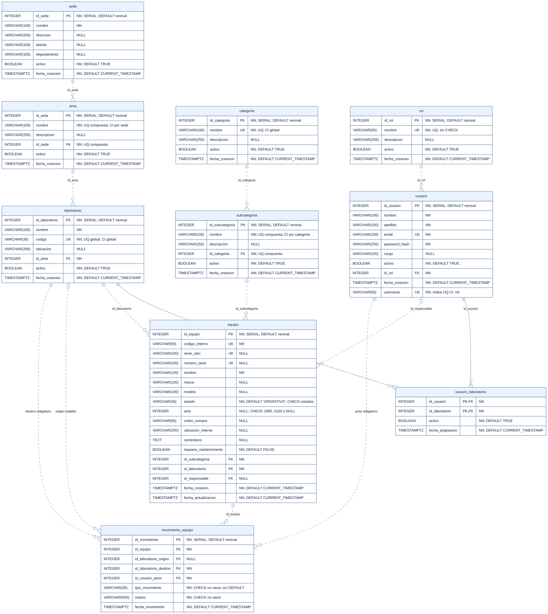
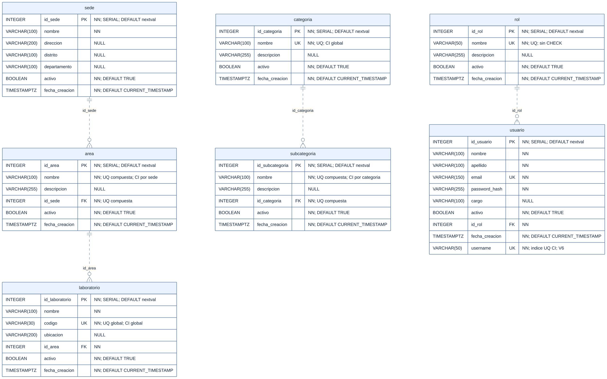
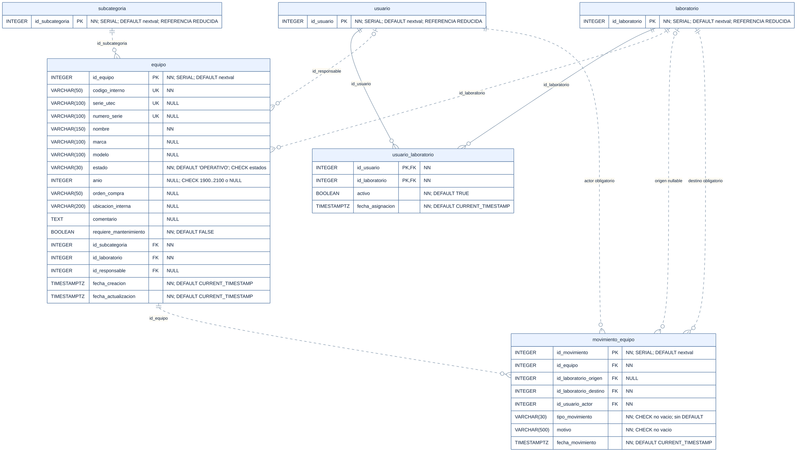

# ERD físico PostgreSQL v2

Esquema de dominio **derivado estáticamente de Flyway V1–V9**, contrastado con las
nueve Entities JPA actuales tras Sprint 5. La revisión del ERD es estática: describe el
DDL resultante de esas migraciones, sin afirmar una inspección del catálogo de una
instancia local. No modifica código, migraciones ni datos.

**10 tablas · 76 columnas · 10 PK · 13 FK · 9 constraints UNIQUE · 4 CHECK ·
17 índices adicionales explícitos.** Los 17 índices se dividen en 12 índices para
FK y 5 índices UNIQUE sobre expresiones con `UPPER`. Los índices implícitos de las
PK y de los UNIQUE no están incluidos en esos 17.

Herramienta: **Mermaid ER** dentro de este Markdown, editable y versionable. Las
vistas auxiliares permiten leer los detalles sin depender de una imagen general
muy grande. `flyway_schema_history` es infraestructura de Flyway y queda fuera
de las diez tablas del dominio.

## 1. Fuentes y alcance

| Migración | Efecto relevante |
|---|---|
| [V1](../../backend/inventario/src/main/resources/db/migration/V1__crear_organizacion_y_catalogos.sql) | Crea sede, area, laboratorio, categoria y subcategoria; PK, FK, UNIQUE e índices FK. |
| [V2](../../backend/inventario/src/main/resources/db/migration/V2__crear_usuarios_y_seguridad.sql) | Crea rol, usuario y usuario_laboratorio; PK, FK, UNIQUE e índices FK. |
| [V3](../../backend/inventario/src/main/resources/db/migration/V3__crear_equipos_y_movimientos.sql) | Crea equipo y movimiento_equipo completos; PK, FK, UNIQUE, CHECK e índices FK. |
| [V4](../../backend/inventario/src/main/resources/db/migration/V4__insertar_datos_iniciales.sql) | Inserta datos iniciales; no agrega columnas, constraints, defaults ni CHECK de roles. |
| [V5](../../backend/inventario/src/main/resources/db/migration/V5__categoria_nombre_unico_sin_mayusculas.sql) | Índice UNIQUE global sobre UPPER(categoria.nombre). |
| [V6](../../backend/inventario/src/main/resources/db/migration/V6__agregar_username_usuario.sql) | Agrega usuario.username, completa usuarios existentes con usuario_ID, establece NOT NULL e índice UNIQUE sobre UPPER(username). El valor de actualización no es un DEFAULT. |
| [V7](../../backend/inventario/src/main/resources/db/migration/V7__subcategoria_nombre_unico_por_categoria_sin_mayusculas.sql) | Detecta duplicados y agrega índice UNIQUE de subcategoría por categoría y nombre sin distinguir mayúsculas. |
| [V8](../../backend/inventario/src/main/resources/db/migration/V8__area_nombre_unico_por_sede_sin_mayusculas.sql) | Detecta duplicados y agrega índice UNIQUE de área por sede y nombre sin distinguir mayúsculas. |
| [V9](../../backend/inventario/src/main/resources/db/migration/V9__laboratorio_codigo_unico_sin_mayusculas.sql) | Detecta duplicados y agrega índice UNIQUE global de código de laboratorio sin distinguir mayúsculas. |

Contraste JPA: [directorio entity](../../backend/inventario/src/main/java/com/utec/inventario/entity/),
con `SedeEntity`, `AreaEntity`, `LaboratorioEntity`, `CategoriaEntity`,
`SubcategoriaEntity`, `RolEntity`, `UsuarioEntity`, `UsuarioLaboratorioEntity` y
`EquipoEntity`. Como apoyo del estado
implementado se revisaron el [README](../../README.md) y el [Sprint 4](../sprints/sprint-4.md).
Los diagramas antiguos no determinan ningún atributo de este modelo.

## 2. Leyenda y convenciones

| Notación | Significado |
|---|---|
| PK | Clave primaria. En usuario_laboratorio, ambas columnas forman una sola PK compuesta. |
| FK | Clave foránea; la tabla de constraints identifica destino y acciones. |
| UQ / UK | Unicidad. Mermaid imprime UK; en el texto se usa UQ. UK puede corresponder a un constraint UNIQUE o a un índice UNIQUE, según el comentario y la tabla de constraints. |
| UQ compuesta | Unicidad del conjunto de columnas; no significa que cada columna sea única individualmente. |
| CI | Comparación de unicidad mediante UPPER; no hay predicado parcial por activo. |
| NN / NULL | NOT NULL / admite NULL. Todas las PK implican NN. |
| DEFAULT | Expresión aplicada cuando se omite la columna al insertar; no es una actualización automática. |
| CHECK | Restricción real del DDL, detallada en la sección 6. |
| `||` / `o|` o `|o` / `o{` | Exactamente uno / cero o uno / cero o muchos. El lado del padre indica cuántos padres admite cada fila hija. |
| Línea discontinua | Relación no identificadora: la FK no forma parte de la PK hija. Las relaciones a usuario_laboratorio son identificadoras y se dibujan con línea continua. |

Los nueve identificadores creados con **SERIAL** se muestran con tipo físico
`INTEGER`: SERIAL es la abreviatura de entero, secuencia y DEFAULT
`nextval(...)`; **no es una columna SQL GENERATED ... AS IDENTITY**.
`GenerationType.IDENTITY` en Java no cambia el DDL de Flyway. En las cajas,
`SERIAL; DEFAULT nextval` abrevia la expresión exacta que aparece en el
diccionario de columnas. La secuencia es propia de cada identificador.

`TIMESTAMPTZ` equivale a `timestamp with time zone`; no se sustituye por
`TIMESTAMP`. `VARCHAR(n)`, `INTEGER`, `BOOLEAN` y `TEXT` conservan los tipos
declarados o su tipo físico equivalente.

**Estado de implementación, sin cambiar el esquema:**

| Estado | Tablas |
|---|---|
| Implementado en Java/API | rol, usuario, categoria, subcategoria, sede, area, laboratorio, usuario_laboratorio, equipo |
| Solo esquema BD / diseño futuro | movimiento_equipo |

Rol y Usuario participan en JPA y en autenticación/autorización JWT. Esta leyenda
no afirma que ambos tengan un CRUD público completo. Sprint 4E implementa
UsuarioLaboratorio y el servicio de alcance efectivo sin cambios de esquema ni
V10. Sprint 5 implementa Equipo y aplica alcance, también sin migración nueva.
MovimientoEquipo sigue pendiente. Ser responsable de un Equipo no concede permisos.

## 3. Vista física completa

[SVG completo](erd-fisico-v2.svg). El diccionario de la sección 5 permite
consultar columnas y defaults sin ampliar el gráfico. Los 76 atributos del
esquema aparecen en esta vista.

## 4. Vistas ampliadas

### 4.1. Organización, clasificación e identidad

[SVG de catálogos e identidad](erd-fisico-v2-catalogos.svg). Contiene siete de las nueve
tablas implementadas en Java/API, con todas sus columnas. UsuarioLaboratorio,
incorporada en Sprint 4E, y Equipo, incorporado en Sprint 5, conservan su vista
ampliada junto a inventario. Las relaciones hacia
tablas que no aparecen en esta vista se conservan en el diagrama general.

### 4.2. Asignaciones, inventario y trazabilidad

[SVG de inventario y trazabilidad](erd-fisico-v2-inventario.svg). Muestra completas
usuario_laboratorio, equipo y movimiento_equipo. **usuario, laboratorio y
subcategoria son referencias reducidas: solo se repite su PK para mostrar las
relaciones.** Sus demás columnas están en la vista general y el diccionario;
no se han eliminado del modelo físico.

## 5. Diccionario completo de columnas

`—` en DEFAULT significa **no hay DEFAULT declarado**. Una columna nullable
sin DEFAULT recibe NULL al omitirla; una columna NN sin DEFAULT requiere valor.
Las expresiones `nextval('..._seq'::regclass)` corresponden a las secuencias
generadas por SERIAL en V1–V3. Los nombres se derivan del DDL, sin consultar una
base en ejecución. El orden de `usuario.username` refleja su incorporación
posterior en V6.

### sede — 7 columnas

Fuente: [V1](../../backend/inventario/src/main/resources/db/migration/V1__crear_organizacion_y_catalogos.sql). Implementada en Java/API.

| Columna | Tipo PostgreSQL | Clave / regla | Nullability | DEFAULT |
|---|---|---|---|---|
| `id_sede` | `INTEGER` | PK | NN | `nextval('sede_id_sede_seq'::regclass)` |
| `nombre` | `VARCHAR(100)` | — | NN | — |
| `direccion` | `VARCHAR(200)` | — | NULL | — |
| `distrito` | `VARCHAR(100)` | — | NULL | — |
| `departamento` | `VARCHAR(100)` | — | NULL | — |
| `activo` | `BOOLEAN` | — | NN | `TRUE` |
| `fecha_creacion` | `TIMESTAMPTZ` | — | NN | `CURRENT_TIMESTAMP` |

### area — 6 columnas

Fuente: [V1](../../backend/inventario/src/main/resources/db/migration/V1__crear_organizacion_y_catalogos.sql). Implementada en Java/API.

| Columna | Tipo PostgreSQL | Clave / regla | Nullability | DEFAULT |
|---|---|---|---|---|
| `id_area` | `INTEGER` | PK | NN | `nextval('area_id_area_seq'::regclass)` |
| `nombre` | `VARCHAR(100)` | UQ compuesta; CI por sede | NN | — |
| `descripcion` | `VARCHAR(255)` | — | NULL | — |
| `id_sede` | `INTEGER` | FK; UQ compuesta | NN | — |
| `activo` | `BOOLEAN` | — | NN | `TRUE` |
| `fecha_creacion` | `TIMESTAMPTZ` | — | NN | `CURRENT_TIMESTAMP` |

### laboratorio — 7 columnas

Fuente: [V1](../../backend/inventario/src/main/resources/db/migration/V1__crear_organizacion_y_catalogos.sql). Implementada en Java/API.

| Columna | Tipo PostgreSQL | Clave / regla | Nullability | DEFAULT |
|---|---|---|---|---|
| `id_laboratorio` | `INTEGER` | PK | NN | `nextval('laboratorio_id_laboratorio_seq'::regclass)` |
| `nombre` | `VARCHAR(100)` | — | NN | — |
| `codigo` | `VARCHAR(30)` | UQ global; CI global | NN | — |
| `ubicacion` | `VARCHAR(200)` | — | NULL | — |
| `id_area` | `INTEGER` | FK | NN | — |
| `activo` | `BOOLEAN` | — | NN | `TRUE` |
| `fecha_creacion` | `TIMESTAMPTZ` | — | NN | `CURRENT_TIMESTAMP` |

### categoria — 5 columnas

Fuente: [V1](../../backend/inventario/src/main/resources/db/migration/V1__crear_organizacion_y_catalogos.sql). Implementada en Java/API.

| Columna | Tipo PostgreSQL | Clave / regla | Nullability | DEFAULT |
|---|---|---|---|---|
| `id_categoria` | `INTEGER` | PK | NN | `nextval('categoria_id_categoria_seq'::regclass)` |
| `nombre` | `VARCHAR(100)` | UQ; CI global | NN | — |
| `descripcion` | `VARCHAR(255)` | — | NULL | — |
| `activo` | `BOOLEAN` | — | NN | `TRUE` |
| `fecha_creacion` | `TIMESTAMPTZ` | — | NN | `CURRENT_TIMESTAMP` |

### subcategoria — 6 columnas

Fuente: [V1](../../backend/inventario/src/main/resources/db/migration/V1__crear_organizacion_y_catalogos.sql). Implementada en Java/API.

| Columna | Tipo PostgreSQL | Clave / regla | Nullability | DEFAULT |
|---|---|---|---|---|
| `id_subcategoria` | `INTEGER` | PK | NN | `nextval('subcategoria_id_subcategoria_seq'::regclass)` |
| `nombre` | `VARCHAR(100)` | UQ compuesta; CI por categoria | NN | — |
| `descripcion` | `VARCHAR(255)` | — | NULL | — |
| `id_categoria` | `INTEGER` | FK; UQ compuesta | NN | — |
| `activo` | `BOOLEAN` | — | NN | `TRUE` |
| `fecha_creacion` | `TIMESTAMPTZ` | — | NN | `CURRENT_TIMESTAMP` |

### rol — 5 columnas

Fuente: [V2](../../backend/inventario/src/main/resources/db/migration/V2__crear_usuarios_y_seguridad.sql). Implementada en Java/API.

| Columna | Tipo PostgreSQL | Clave / regla | Nullability | DEFAULT |
|---|---|---|---|---|
| `id_rol` | `INTEGER` | PK | NN | `nextval('rol_id_rol_seq'::regclass)` |
| `nombre` | `VARCHAR(50)` | UQ; sin CHECK | NN | — |
| `descripcion` | `VARCHAR(255)` | — | NULL | — |
| `activo` | `BOOLEAN` | — | NN | `TRUE` |
| `fecha_creacion` | `TIMESTAMPTZ` | — | NN | `CURRENT_TIMESTAMP` |

### usuario — 10 columnas

Fuente: [V2](../../backend/inventario/src/main/resources/db/migration/V2__crear_usuarios_y_seguridad.sql) + [V6](../../backend/inventario/src/main/resources/db/migration/V6__agregar_username_usuario.sql). Implementada en Java/API.

| Columna | Tipo PostgreSQL | Clave / regla | Nullability | DEFAULT |
|---|---|---|---|---|
| `id_usuario` | `INTEGER` | PK | NN | `nextval('usuario_id_usuario_seq'::regclass)` |
| `nombre` | `VARCHAR(100)` | — | NN | — |
| `apellido` | `VARCHAR(100)` | — | NN | — |
| `email` | `VARCHAR(150)` | UQ | NN | — |
| `password_hash` | `VARCHAR(255)` | — | NN | — |
| `cargo` | `VARCHAR(100)` | — | NULL | — |
| `activo` | `BOOLEAN` | — | NN | `TRUE` |
| `id_rol` | `INTEGER` | FK | NN | — |
| `fecha_creacion` | `TIMESTAMPTZ` | — | NN | `CURRENT_TIMESTAMP` |
| `username` | `VARCHAR(50)` | UQ; indice UQ CI; V6 | NN | — |

### usuario_laboratorio — 4 columnas

Fuente: [V2](../../backend/inventario/src/main/resources/db/migration/V2__crear_usuarios_y_seguridad.sql). Implementada en Java/API desde Sprint 4E; estructura sin cambios.

| Columna | Tipo PostgreSQL | Clave / regla | Nullability | DEFAULT |
|---|---|---|---|---|
| `id_usuario` | `INTEGER` | PK, FK | NN | — |
| `id_laboratorio` | `INTEGER` | PK, FK | NN | — |
| `activo` | `BOOLEAN` | — | NN | `TRUE` |
| `fecha_asignacion` | `TIMESTAMPTZ` | — | NN | `CURRENT_TIMESTAMP` |

### equipo — 18 columnas

Fuente: [V3](../../backend/inventario/src/main/resources/db/migration/V3__crear_equipos_y_movimientos.sql). Implementada en Java/API desde Sprint 5; estructura sin cambios.

| Columna | Tipo PostgreSQL | Clave / regla | Nullability | DEFAULT |
|---|---|---|---|---|
| `id_equipo` | `INTEGER` | PK | NN | `nextval('equipo_id_equipo_seq'::regclass)` |
| `codigo_interno` | `VARCHAR(50)` | UQ | NN | — |
| `serie_utec` | `VARCHAR(100)` | UQ | NULL | — |
| `numero_serie` | `VARCHAR(100)` | UQ | NULL | — |
| `nombre` | `VARCHAR(150)` | — | NN | — |
| `marca` | `VARCHAR(100)` | — | NULL | — |
| `modelo` | `VARCHAR(100)` | — | NULL | — |
| `estado` | `VARCHAR(30)` | CHECK estados | NN | `'OPERATIVO'` |
| `anio` | `INTEGER` | CHECK 1900..2100 o NULL | NULL | — |
| `orden_compra` | `VARCHAR(50)` | — | NULL | — |
| `ubicacion_interna` | `VARCHAR(200)` | — | NULL | — |
| `comentario` | `TEXT` | — | NULL | — |
| `requiere_mantenimiento` | `BOOLEAN` | — | NN | `FALSE` |
| `id_subcategoria` | `INTEGER` | FK | NN | — |
| `id_laboratorio` | `INTEGER` | FK | NN | — |
| `id_responsable` | `INTEGER` | FK | NULL | — |
| `fecha_creacion` | `TIMESTAMPTZ` | — | NN | `CURRENT_TIMESTAMP` |
| `fecha_actualizacion` | `TIMESTAMPTZ` | — | NN | `CURRENT_TIMESTAMP` |

### movimiento_equipo — 8 columnas

Fuente: [V3](../../backend/inventario/src/main/resources/db/migration/V3__crear_equipos_y_movimientos.sql). Solo esquema BD / diseño futuro.

| Columna | Tipo PostgreSQL | Clave / regla | Nullability | DEFAULT |
|---|---|---|---|---|
| `id_movimiento` | `INTEGER` | PK | NN | `nextval('movimiento_equipo_id_movimiento_seq'::regclass)` |
| `id_equipo` | `INTEGER` | FK | NN | — |
| `id_laboratorio_origen` | `INTEGER` | FK | NULL | — |
| `id_laboratorio_destino` | `INTEGER` | FK | NN | — |
| `id_usuario_actor` | `INTEGER` | FK | NN | — |
| `tipo_movimiento` | `VARCHAR(30)` | CHECK no vacio; sin DEFAULT | NN | — |
| `motivo` | `VARCHAR(500)` | CHECK no vacio | NN | — |
| `fecha_movimiento` | `TIMESTAMPTZ` | — | NN | `CURRENT_TIMESTAMP` |

## 6. Constraints e índices del esquema final

Las nueve PK individuales se declaran sin nombre explícito; se muestran los
nombres convencionales generados por PostgreSQL (`tabla_pkey`). La PK compuesta
`pk_usuario_laboratorio` sí tiene nombre explícito. Los demás nombres de esta
tabla están escritos en las migraciones. Se incluyen **todas** las PK, FK,
constraints UNIQUE y CHECK, y todos los `CREATE INDEX` de V1–V9.

Todos los índices de la tabla usan el método predeterminado B-tree; las
migraciones no especifican otro método. Los 10 PK y los 9 constraints UNIQUE
crean sus propios índices implícitos, además de los 17 índices explícitos.

| Tabla | Constraint/Índice | Tipo | Columnas/Expresión | Migración |
|---|---|---|---|---|
| `sede` | `sede_pkey` | PK | `(id_sede)` | [V1](../../backend/inventario/src/main/resources/db/migration/V1__crear_organizacion_y_catalogos.sql) |
| `area` | `area_pkey` | PK | `(id_area)` | [V1](../../backend/inventario/src/main/resources/db/migration/V1__crear_organizacion_y_catalogos.sql) |
| `laboratorio` | `laboratorio_pkey` | PK | `(id_laboratorio)` | [V1](../../backend/inventario/src/main/resources/db/migration/V1__crear_organizacion_y_catalogos.sql) |
| `categoria` | `categoria_pkey` | PK | `(id_categoria)` | [V1](../../backend/inventario/src/main/resources/db/migration/V1__crear_organizacion_y_catalogos.sql) |
| `subcategoria` | `subcategoria_pkey` | PK | `(id_subcategoria)` | [V1](../../backend/inventario/src/main/resources/db/migration/V1__crear_organizacion_y_catalogos.sql) |
| `rol` | `rol_pkey` | PK | `(id_rol)` | [V2](../../backend/inventario/src/main/resources/db/migration/V2__crear_usuarios_y_seguridad.sql) |
| `usuario` | `usuario_pkey` | PK | `(id_usuario)` | [V2](../../backend/inventario/src/main/resources/db/migration/V2__crear_usuarios_y_seguridad.sql) |
| `usuario_laboratorio` | `pk_usuario_laboratorio` | PK | `(id_usuario, id_laboratorio)` | [V2](../../backend/inventario/src/main/resources/db/migration/V2__crear_usuarios_y_seguridad.sql) |
| `equipo` | `equipo_pkey` | PK | `(id_equipo)` | [V3](../../backend/inventario/src/main/resources/db/migration/V3__crear_equipos_y_movimientos.sql) |
| `movimiento_equipo` | `movimiento_equipo_pkey` | PK | `(id_movimiento)` | [V3](../../backend/inventario/src/main/resources/db/migration/V3__crear_equipos_y_movimientos.sql) |
| `area` | `fk_area_sede` | FK | `(id_sede) → sede(id_sede); UPDATE RESTRICT; DELETE RESTRICT` | [V1](../../backend/inventario/src/main/resources/db/migration/V1__crear_organizacion_y_catalogos.sql) |
| `laboratorio` | `fk_laboratorio_area` | FK | `(id_area) → area(id_area); UPDATE RESTRICT; DELETE RESTRICT` | [V1](../../backend/inventario/src/main/resources/db/migration/V1__crear_organizacion_y_catalogos.sql) |
| `subcategoria` | `fk_subcategoria_categoria` | FK | `(id_categoria) → categoria(id_categoria); UPDATE RESTRICT; DELETE RESTRICT` | [V1](../../backend/inventario/src/main/resources/db/migration/V1__crear_organizacion_y_catalogos.sql) |
| `usuario` | `fk_usuario_rol` | FK | `(id_rol) → rol(id_rol); UPDATE RESTRICT; DELETE RESTRICT` | [V2](../../backend/inventario/src/main/resources/db/migration/V2__crear_usuarios_y_seguridad.sql) |
| `usuario_laboratorio` | `fk_usuario_laboratorio_usuario` | FK | `(id_usuario) → usuario(id_usuario); UPDATE RESTRICT; DELETE RESTRICT` | [V2](../../backend/inventario/src/main/resources/db/migration/V2__crear_usuarios_y_seguridad.sql) |
| `usuario_laboratorio` | `fk_usuario_laboratorio_laboratorio` | FK | `(id_laboratorio) → laboratorio(id_laboratorio); UPDATE RESTRICT; DELETE RESTRICT` | [V2](../../backend/inventario/src/main/resources/db/migration/V2__crear_usuarios_y_seguridad.sql) |
| `equipo` | `fk_equipo_subcategoria` | FK | `(id_subcategoria) → subcategoria(id_subcategoria); UPDATE RESTRICT; DELETE RESTRICT` | [V3](../../backend/inventario/src/main/resources/db/migration/V3__crear_equipos_y_movimientos.sql) |
| `equipo` | `fk_equipo_laboratorio` | FK | `(id_laboratorio) → laboratorio(id_laboratorio); UPDATE RESTRICT; DELETE RESTRICT` | [V3](../../backend/inventario/src/main/resources/db/migration/V3__crear_equipos_y_movimientos.sql) |
| `equipo` | `fk_equipo_responsable` | FK | `(id_responsable) → usuario(id_usuario); UPDATE RESTRICT; DELETE RESTRICT` | [V3](../../backend/inventario/src/main/resources/db/migration/V3__crear_equipos_y_movimientos.sql) |
| `movimiento_equipo` | `fk_movimiento_equipo_equipo` | FK | `(id_equipo) → equipo(id_equipo); UPDATE RESTRICT; DELETE RESTRICT` | [V3](../../backend/inventario/src/main/resources/db/migration/V3__crear_equipos_y_movimientos.sql) |
| `movimiento_equipo` | `fk_movimiento_equipo_origen` | FK | `(id_laboratorio_origen) → laboratorio(id_laboratorio); UPDATE RESTRICT; DELETE RESTRICT` | [V3](../../backend/inventario/src/main/resources/db/migration/V3__crear_equipos_y_movimientos.sql) |
| `movimiento_equipo` | `fk_movimiento_equipo_destino` | FK | `(id_laboratorio_destino) → laboratorio(id_laboratorio); UPDATE RESTRICT; DELETE RESTRICT` | [V3](../../backend/inventario/src/main/resources/db/migration/V3__crear_equipos_y_movimientos.sql) |
| `movimiento_equipo` | `fk_movimiento_equipo_actor` | FK | `(id_usuario_actor) → usuario(id_usuario); UPDATE RESTRICT; DELETE RESTRICT` | [V3](../../backend/inventario/src/main/resources/db/migration/V3__crear_equipos_y_movimientos.sql) |
| `area` | `uq_area_nombre_sede` | UQ (constraint) | `(nombre, id_sede)` | [V1](../../backend/inventario/src/main/resources/db/migration/V1__crear_organizacion_y_catalogos.sql) |
| `laboratorio` | `uq_laboratorio_codigo` | UQ (constraint) | `(codigo)` | [V1](../../backend/inventario/src/main/resources/db/migration/V1__crear_organizacion_y_catalogos.sql) |
| `categoria` | `uq_categoria_nombre` | UQ (constraint) | `(nombre)` | [V1](../../backend/inventario/src/main/resources/db/migration/V1__crear_organizacion_y_catalogos.sql) |
| `subcategoria` | `uq_subcategoria_nombre_categoria` | UQ (constraint) | `(nombre, id_categoria)` | [V1](../../backend/inventario/src/main/resources/db/migration/V1__crear_organizacion_y_catalogos.sql) |
| `rol` | `uq_rol_nombre` | UQ (constraint) | `(nombre)` | [V2](../../backend/inventario/src/main/resources/db/migration/V2__crear_usuarios_y_seguridad.sql) |
| `usuario` | `uq_usuario_email` | UQ (constraint) | `(email)` | [V2](../../backend/inventario/src/main/resources/db/migration/V2__crear_usuarios_y_seguridad.sql) |
| `equipo` | `uq_equipo_codigo_interno` | UQ (constraint) | `(codigo_interno)` | [V3](../../backend/inventario/src/main/resources/db/migration/V3__crear_equipos_y_movimientos.sql) |
| `equipo` | `uq_equipo_serie_utec` | UQ (constraint) | `(serie_utec)` | [V3](../../backend/inventario/src/main/resources/db/migration/V3__crear_equipos_y_movimientos.sql) |
| `equipo` | `uq_equipo_numero_serie` | UQ (constraint) | `(numero_serie)` | [V3](../../backend/inventario/src/main/resources/db/migration/V3__crear_equipos_y_movimientos.sql) |
| `equipo` | `ck_equipo_estado` | CHECK | `estado IN ('OPERATIVO', 'MANTENIMIENTO', 'INOPERATIVO', 'BAJA')` | [V3](../../backend/inventario/src/main/resources/db/migration/V3__crear_equipos_y_movimientos.sql) |
| `equipo` | `ck_equipo_anio` | CHECK | `anio IS NULL OR anio BETWEEN 1900 AND 2100` | [V3](../../backend/inventario/src/main/resources/db/migration/V3__crear_equipos_y_movimientos.sql) |
| `movimiento_equipo` | `ck_movimiento_equipo_tipo_no_vacio` | CHECK | `BTRIM(tipo_movimiento) <> ''` | [V3](../../backend/inventario/src/main/resources/db/migration/V3__crear_equipos_y_movimientos.sql) |
| `movimiento_equipo` | `ck_movimiento_equipo_motivo_no_vacio` | CHECK | `BTRIM(motivo) <> ''` | [V3](../../backend/inventario/src/main/resources/db/migration/V3__crear_equipos_y_movimientos.sql) |
| `area` | `idx_area_id_sede` | Índice FK | `(id_sede)` | [V1](../../backend/inventario/src/main/resources/db/migration/V1__crear_organizacion_y_catalogos.sql) |
| `laboratorio` | `idx_laboratorio_id_area` | Índice FK | `(id_area)` | [V1](../../backend/inventario/src/main/resources/db/migration/V1__crear_organizacion_y_catalogos.sql) |
| `subcategoria` | `idx_subcategoria_id_categoria` | Índice FK | `(id_categoria)` | [V1](../../backend/inventario/src/main/resources/db/migration/V1__crear_organizacion_y_catalogos.sql) |
| `usuario` | `idx_usuario_id_rol` | Índice FK | `(id_rol)` | [V2](../../backend/inventario/src/main/resources/db/migration/V2__crear_usuarios_y_seguridad.sql) |
| `usuario_laboratorio` | `idx_usuario_laboratorio_id_laboratorio` | Índice FK | `(id_laboratorio)` | [V2](../../backend/inventario/src/main/resources/db/migration/V2__crear_usuarios_y_seguridad.sql) |
| `equipo` | `idx_equipo_id_subcategoria` | Índice FK | `(id_subcategoria)` | [V3](../../backend/inventario/src/main/resources/db/migration/V3__crear_equipos_y_movimientos.sql) |
| `equipo` | `idx_equipo_id_laboratorio` | Índice FK | `(id_laboratorio)` | [V3](../../backend/inventario/src/main/resources/db/migration/V3__crear_equipos_y_movimientos.sql) |
| `equipo` | `idx_equipo_id_responsable` | Índice FK | `(id_responsable)` | [V3](../../backend/inventario/src/main/resources/db/migration/V3__crear_equipos_y_movimientos.sql) |
| `movimiento_equipo` | `idx_movimiento_equipo_id_equipo` | Índice FK | `(id_equipo)` | [V3](../../backend/inventario/src/main/resources/db/migration/V3__crear_equipos_y_movimientos.sql) |
| `movimiento_equipo` | `idx_movimiento_equipo_id_laboratorio_origen` | Índice FK | `(id_laboratorio_origen)` | [V3](../../backend/inventario/src/main/resources/db/migration/V3__crear_equipos_y_movimientos.sql) |
| `movimiento_equipo` | `idx_movimiento_equipo_id_laboratorio_destino` | Índice FK | `(id_laboratorio_destino)` | [V3](../../backend/inventario/src/main/resources/db/migration/V3__crear_equipos_y_movimientos.sql) |
| `movimiento_equipo` | `idx_movimiento_equipo_id_usuario_actor` | Índice FK | `(id_usuario_actor)` | [V3](../../backend/inventario/src/main/resources/db/migration/V3__crear_equipos_y_movimientos.sql) |
| `categoria` | `uq_categoria_nombre_ignore_case` | Índice UQ CI | `(UPPER(nombre))` | [V5](../../backend/inventario/src/main/resources/db/migration/V5__categoria_nombre_unico_sin_mayusculas.sql) |
| `usuario` | `uq_usuario_username_ignore_case` | Índice UQ CI | `(UPPER(username))` | [V6](../../backend/inventario/src/main/resources/db/migration/V6__agregar_username_usuario.sql) |
| `subcategoria` | `uq_subcategoria_categoria_nombre_ignore_case` | Índice UQ CI | `(id_categoria, UPPER(nombre))` | [V7](../../backend/inventario/src/main/resources/db/migration/V7__subcategoria_nombre_unico_por_categoria_sin_mayusculas.sql) |
| `area` | `uq_area_sede_nombre_ignore_case` | Índice UQ CI | `(id_sede, UPPER(nombre))` | [V8](../../backend/inventario/src/main/resources/db/migration/V8__area_nombre_unico_por_sede_sin_mayusculas.sql) |
| `laboratorio` | `uq_laboratorio_codigo_ignore_case` | Índice UQ CI | `(UPPER(codigo))` | [V9](../../backend/inventario/src/main/resources/db/migration/V9__laboratorio_codigo_unico_sin_mayusculas.sql) |

### 6.1. Unicidad y bajas lógicas

Los cuatro UNIQUE originales de categoria, subcategoria, area y laboratorio
**coexisten** con los índices posteriores sobre UPPER. No se han eliminado ni
ocultado. Los índices UPPER no tienen `WHERE activo = TRUE`: las filas inactivas
también reservan nombre, código o username.

| Tabla | UNIQUE original conservado | Índice posterior / alcance |
|---|---|---|
| categoria | `UNIQUE(nombre)` | V5: `UPPER(nombre)`, global |
| subcategoria | `UNIQUE(nombre, id_categoria)` | V7: `(id_categoria, UPPER(nombre))`, por categoría |
| area | `UNIQUE(nombre, id_sede)` | V8: `(id_sede, UPPER(nombre))`, por sede |
| laboratorio | `UNIQUE(codigo)` | V9: `UPPER(codigo)`, **global**, también entre áreas distintas |
| usuario | `UNIQUE(email)`, en una columna diferente | V6: `UPPER(username)`, global; no existe un UNIQUE sensible a mayúsculas adicional sobre username |

El mismo nombre de Subcategoria puede existir en categorías distintas; lo mismo
ocurre con Area en sedes distintas. **No existe `UNIQUE(id_area, codigo)`.**
Sede.nombre y Laboratorio.nombre no tienen UNIQUE. Email, Rol.nombre y los tres
identificadores únicos de Equipo conservan su UNIQUE directo: V1–V9 no les
agregan un índice UPPER.

`serie_utec` y `numero_serie` admiten NULL y son UNIQUE. Al no declarar
`NULLS NOT DISTINCT`, sus UNIQUE permiten varias filas con NULL; los valores
no nulos sí deben ser únicos. La PK de usuario_laboratorio evita duplicar el
mismo par de usuario y laboratorio, incluso cuando la asignación está inactiva.

### 6.2. CHECK reales y límites de lo que garantizan

Existen exactamente **cuatro CHECK**, todos de V3:

1. `ck_equipo_estado`: permite OPERATIVO, MANTENIMIENTO, INOPERATIVO y BAJA.
2. `ck_equipo_anio`: permite NULL o años entre 1900 y 2100, ambos inclusive.
3. `ck_movimiento_equipo_tipo_no_vacio`: exige
   `BTRIM(tipo_movimiento) <> ''`.
4. `ck_movimiento_equipo_motivo_no_vacio`: exige
   `BTRIM(motivo) <> ''`.

No hay CHECK sobre Rol.nombre: ADMIN, GESTOR y LECTOR son datos iniciales de V4,
no una enumeración SQL cerrada. Tipo_movimiento tampoco es un enum ni tiene un
CHECK de valores permitidos; solo se comprueba que BTRIM no resulte vacío.
BTRIM sin caracteres adicionales recorta espacios, no representa una validación
general de todo carácter de espacio en blanco. No existe CHECK que obligue a
origen y destino a ser distintos, ni que ate el origen al laboratorio actual
del equipo.

### 6.3. Acciones de las FK e índices de apoyo

Las **13 FK** de V1–V3 declaran explícitamente **ON UPDATE RESTRICT y ON DELETE
RESTRICT**. No hay CASCADE ni SET NULL, tampoco en las dos referencias opcionales.
NULL permite omitir la relación; no habilita el borrado físico de un padre que
sí esté referenciado.

Hay 12 índices adicionales de FK para 13 FK. La excepción es
`usuario_laboratorio.id_usuario`: la PK compuesta
`(id_usuario, id_laboratorio)` ya comienza por esa columna; V2 lo explica y
solo añade el índice separado de id_laboratorio. Los índices adicionales
conservan los nombres y el orden de columnas declarados.

Las FK garantizan existencia del padre, no su estado `activo`. Las restricciones
de baja lógica y de creación bajo un padre activo implementadas en servicios
Java son reglas de aplicación; no se inventan CHECK o FK adicionales en este
ERD. RESTRICT actúa sobre DELETE/UPDATE de las claves referenciadas, no sobre un
cambio de `activo`.

## 7. Optionalidad validada contra Flyway

| Relación | Padre por fila hija | Hijas por padre | Columna de la hija |
|---|---|---|---|
| Sede → Area | 1 obligatorio | 0..N | `area.id_sede` NN |
| Area → Laboratorio | 1 obligatorio | 0..N | `laboratorio.id_area` NN |
| Categoria → Subcategoria | 1 obligatorio | 0..N | `subcategoria.id_categoria` NN |
| Rol → Usuario | 1 obligatorio | 0..N | `usuario.id_rol` NN |
| Usuario → UsuarioLaboratorio | 1 obligatorio | 0..N | `usuario_laboratorio.id_usuario` NN, parte de PK |
| Laboratorio → UsuarioLaboratorio | 1 obligatorio | 0..N | `usuario_laboratorio.id_laboratorio` NN, parte de PK |
| Subcategoria → Equipo | 1 obligatorio | 0..N | `equipo.id_subcategoria` NN |
| Laboratorio → Equipo | 1 obligatorio | 0..N | `equipo.id_laboratorio` NN |
| Usuario → Equipo, responsable/custodio | 0..1 opcional | 0..N | `equipo.id_responsable` NULL |
| Equipo → MovimientoEquipo | 1 obligatorio | 0..N | `movimiento_equipo.id_equipo` NN |
| Laboratorio → MovimientoEquipo, origen | 0..1 opcional | 0..N | `movimiento_equipo.id_laboratorio_origen` NULL |
| Laboratorio → MovimientoEquipo, destino | 1 obligatorio | 0..N | `movimiento_equipo.id_laboratorio_destino` NN |
| Usuario → MovimientoEquipo, actor | 1 obligatorio | 0..N | `movimiento_equipo.id_usuario_actor` NN |

El conjunto de asignaciones representa la relación N:M Usuario ↔ Laboratorio;
cada usuario y cada laboratorio pueden tener cero asignaciones. Ninguna FK
exige que un padre tenga al menos una fila hija. Responsable y actor son
relaciones distintas: el responsable puede faltar; el actor de un movimiento
es obligatorio. La responsabilidad no concede autorización sobre el laboratorio.

## 8. Observaciones para una versión futura

Estas observaciones describen decisiones existentes; **no proponen ni ejecutan
cambios dentro de esta tarea**.

- Sede.nombre no es único. No corresponde añadir UQ a su caja por analogía con
  otros catálogos.
- Coexisten UNIQUE sensibles a mayúsculas y los índices posteriores de V5/V7/V8/V9.
  Cualquier evaluación de redundancia requerirá una tarea y migración futuras.
- Equipo no contiene `activo`; desde Sprint 5 su vertical aplica baja lógica
  mediante el valor BAJA de `estado`, sin cambiar la estructura de V3.
- `equipo.fecha_actualizacion` tiene DEFAULT CURRENT_TIMESTAMP al insertar.
  V1–V9 no crean trigger ni otra actualización automática al hacer UPDATE.
- `movimiento_equipo.tipo_movimiento` no tiene DEFAULT ni un catálogo cerrado;
  `motivo` tampoco tiene DEFAULT. El esquema no exige origen distinto de destino.
- Ni Rol.nombre ni los identificadores de equipo tienen protección UPPER en estas
  migraciones. Los datos iniciales de roles no equivalen a un CHECK.
- UsuarioLaboratorio tiene vertical Java/API y servicio de alcance desde Sprint 4E;
  Equipo lo aplica desde Sprint 5. Solo MovimientoEquipo sigue como vertical
  futura. Estos cambios de implementación no cambian el esquema.
- V6 actualiza usernames de filas existentes con `'usuario_' || id_usuario`;
  ese backfill no crea un DEFAULT para nuevas filas.
- Los índices UPPER no expresan normalización de espacios ni equivalencia de
  acentos. Las restricciones físicas no deben confundirse con el trim de
  determinados servicios Java.

## 9. Control documental

| Comprobación estática | Resultado |
|---|---|
| Diez tablas de dominio | sede, area, laboratorio, categoria, subcategoria, rol, usuario, usuario_laboratorio, equipo y movimiento_equipo |
| Columnas por tabla | 7 + 6 + 7 + 5 + 6 + 5 + 10 + 4 + 18 + 8 = **76** |
| Claves primarias | **10**: nueve individuales SERIAL y una compuesta |
| Claves foráneas | **13**, destinos y nullability documentados; RESTRICT en ambas acciones |
| Constraints UNIQUE | **9**, conservados junto a índices posteriores |
| CHECK | **4**, todos de V3 y con expresiones completas |
| Índices explícitos | **17**: 12 para FK y 5 UNIQUE con UPPER de V5–V9 |
| Tipos, NN/NULL y DEFAULT | Cubiertos columna por columna en la sección 5 |
| Fechas | Todas las columnas de fecha del esquema son TIMESTAMPTZ |
| Modelo físico frente a Java | Nueve tablas con Entity; MovimientoEquipo solo en BD |
| Alcance de comprobación | Lectura de fuentes y validación documental; sin tests Java ni acceso a PostgreSQL |

Relacionado: [ERD lógico v2](erd-logico-v2.md) ·
[Comparación v1 → v2](erd-v2-cambios.md).
