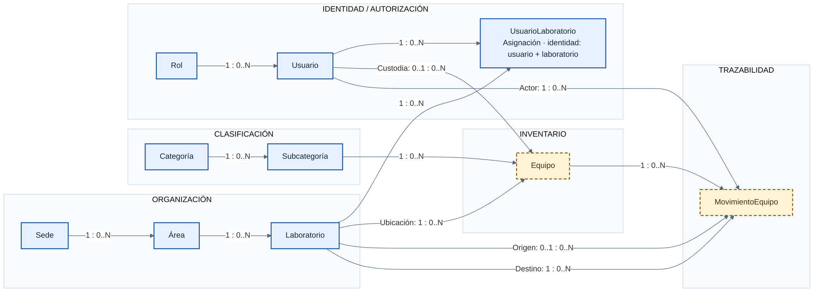

# ERD lógico v2 — Inventario de Laboratorios

Modelo lógico del dominio definido por **Flyway V1–V9**, revisado el
21 de septiembre de 2026. Representa diez entidades y trece relaciones reales;
`flyway_schema_history` es infraestructura de migraciones y queda fuera del
dominio. Las relaciones incluyen registros activos e inactivos: una baja lógica
no elimina la identidad ni la referencia.

La fuente editable es el bloque **Mermaid** de este documento. La
[exportación SVG](erd-logico-v2.svg) permite ampliar el diagrama; el
[ERD físico v2](erd-fisico-v2.md) contiene el detalle de PostgreSQL y el
[documento de cambios](erd-v2-cambios.md) compara esta versión con los PDF
históricos.

## 1. Vista general

La organización se separa de la clasificación del equipo. La identidad describe
usuarios, roles y asignaciones; inventario y trazabilidad enlazan ambas
estructuras. Las flechas van de la entidad referenciada hacia la entidad que
conserva la referencia. Cada etiqueta expresa la cardinalidad de **ambos lados**,
no un orden de ejecución.

**Leyenda de cardinalidades:** `1` = exactamente una referencia obligatoria;
`0..1` = ninguna o una referencia; `0..N` = ningún registro relacionado, uno o
varios. Las etiquetas se leen como **referencias a A por B : registros B por A**,
para una flecha A → B. En «Origen: 0..1 : 0..N», cada movimiento tiene
cero o un laboratorio de origen y cada laboratorio puede ser origen de cero o
múltiples movimientos. El destino se representa por otra relación y es
obligatorio.

**Leyenda de estado:** azul con borde continuo = **implementado en Java/API**;
ámbar con borde discontinuo = **solo esquema BD / diseño futuro de la API**.
El color no cambia el modelo: las diez entidades ya tienen tabla en las
migraciones. Los dos elementos ámbar no son tablas por crear. Sprint 4E incorpora
UsuarioLaboratorio en Java/API sin cambiar entidades, relaciones ni cardinalidades.

## 2. Entidades y significado de negocio

| Bloque | Entidad | Significado |
|---|---|---|
| Organización | Sede | Agrupa áreas de una sede institucional. Su nombre no es una identidad única de negocio. |
| Organización | Área | Agrupa laboratorios y pertenece a una sola sede. Su nombre identifica el área dentro de esa sede. |
| Organización | Laboratorio | Lugar de ubicación de equipos; pertenece a una sola área. Su código identifica al laboratorio globalmente. |
| Clasificación | Categoría | Familia principal del catálogo de equipos. |
| Clasificación | Subcategoría | Clasificación específica de equipos, perteneciente a una categoría. |
| Identidad / autorización | Rol | Perfil de permisos asociado a cada usuario. |
| Identidad / autorización | Usuario | Identidad de acceso; `username` identifica el inicio de sesión. Puede ser actor, responsable o parte de una asignación, con significados distintos. |
| Identidad / autorización | UsuarioLaboratorio | Asignación de un usuario a un laboratorio, con estado y fecha de asignación. Su identidad compuesta es el par usuario–laboratorio. |
| Inventario | Equipo | Bien identificado, clasificado y ubicado en un laboratorio; puede tener un responsable o custodio. |
| Trazabilidad | MovimientoEquipo | Registro de un movimiento de un equipo con actor, destino, tipo, motivo y fecha; el origen puede estar ausente. |

## 3. Las trece relaciones y su optionalidad

En la tabla, **A por B** indica cuántos registros de A puede o debe referenciar
un registro de B; **B por A** indica cuántos registros de B pueden referenciar
al mismo A. Todas las relaciones se derivan de claves foráneas existentes en
V1, V2 o V3; V4–V9 no agregan relaciones.

| # | Entidad A | Relación | Entidad B | A por B | B por A | Significado de negocio | Fuente |
|---|---|---|---|---|---|---|---|
| 1 | Sede | Agrupa | Área | `1` | `0..N` | Toda área pertenece a una sede; una sede puede no tener áreas. | V1 |
| 2 | Área | Agrupa | Laboratorio | `1` | `0..N` | Todo laboratorio pertenece a un área; un área puede no tener laboratorios. | V1 |
| 3 | Categoría | Clasifica | Subcategoría | `1` | `0..N` | Toda subcategoría pertenece a una categoría; una categoría puede no tener subcategorías. | V1 |
| 4 | Rol | Define el perfil de | Usuario | `1` | `0..N` | Cada usuario tiene un rol; un rol puede no estar asignado a ningún usuario. | V2 |
| 5 | Usuario | Participa en | UsuarioLaboratorio | `1` | `0..N` | Cada asignación corresponde a un usuario; un usuario puede no tener asignaciones. | V2 |
| 6 | Laboratorio | Participa en | UsuarioLaboratorio | `1` | `0..N` | Cada asignación corresponde a un laboratorio; un laboratorio puede no tener usuarios asignados. | V2 |
| 7 | Subcategoría | Clasifica | Equipo | `1` | `0..N` | Cada equipo tiene una subcategoría; esta puede no tener equipos. | V3 |
| 8 | Laboratorio | Ubica | Equipo | `1` | `0..N` | Cada equipo tiene un laboratorio de ubicación; este puede no contener equipos. | V3 |
| 9 | Usuario | Es responsable / custodio de | Equipo | `0..1` | `0..N` | Un equipo puede no tener responsable; un usuario puede custodiar varios equipos. | V3 |
| 10 | Equipo | Tiene historial de | MovimientoEquipo | `1` | `0..N` | Cada movimiento corresponde a un equipo; un equipo puede no tener movimientos registrados. | V3 |
| 11 | Usuario | Actúa en | MovimientoEquipo | `1` | `0..N` | Todo movimiento tiene un usuario actor obligatorio; un usuario puede no haber realizado movimientos. | V3 |
| 12 | Laboratorio | Es origen de | MovimientoEquipo | `0..1` | `0..N` | El movimiento puede no informar origen; un laboratorio puede aparecer como origen en varios movimientos. | V3 |
| 13 | Laboratorio | Es destino de | MovimientoEquipo | `1` | `0..N` | Todo movimiento informa un destino; un laboratorio puede aparecer como destino en varios movimientos. | V3 |

**Usuario ↔ Laboratorio es N:M**, resuelto mediante UsuarioLaboratorio: desde
cada extremo se permiten cero o múltiples asignaciones. Cada asignación une
exactamente un usuario y un laboratorio. El par no puede repetirse, incluso si
la asignación está inactiva; no existe un identificador independiente para la
asignación. Su fecha no convierte la tabla puente en un historial de múltiples
asignaciones del mismo par.

No se dibuja una relación directa adicional Usuario–Laboratorio, porque
duplicaría conceptualmente las dos relaciones de la tabla puente. Tampoco se
agregan vínculos directos Equipo–Categoría, Usuario–Área o Laboratorio–Sede:
las rutas a esas entidades pasan por los padres que muestra el diagrama.

## 4. Identidad, permisos, responsabilidad e historial

**La responsabilidad NO concede permisos.** Ser custodio de un equipo no
equivale a estar asignado a su laboratorio, no cambia el rol y no autoriza
consultas ni modificaciones. El usuario actor registra quién realizó un
movimiento; tampoco es una asignación de acceso.

Desde Sprint 4E, UsuarioLaboratorio tiene administración de asignaciones por
ADMIN y consulta del alcance efectivo propio: ADMIN global; GESTOR/LECTOR con
asignación activa a un laboratorio activo. La aplicación a Equipo sigue pendiente.
La autorización conserva JWT y el rol vigente. Los catálogos de Categoría,
Subcategoría, Sede, Área y Laboratorio permiten consultas a ADMIN, GESTOR y
LECTOR, y escritura a ADMIN; todavía no filtran por asignaciones de laboratorio.
Véanse la [matriz de permisos](../matriz-permisos.md) y la
[guía JWT](../autenticacion-jwt.md).

El origen de MovimientoEquipo es opcional; el destino, el equipo y el actor son
obligatorios. Estas referencias permiten registrar el hecho histórico, pero
por sí solas no implementan un traslado, una autorización ni una actualización
automática de la ubicación de Equipo. V3 tampoco exige que origen y destino
sean distintos o que alguno coincida con el laboratorio actual del equipo.

## 5. Identificadores de negocio conservados

Estas reglas precisan la identidad de negocio sin mezclar el diagrama lógico
con detalles de índices o tipos de almacenamiento:

| Entidad | Regla vigente derivada de las migraciones |
|---|---|
| Sede | El nombre puede repetirse. |
| Área | El nombre no puede repetirse dentro de una sede, sin distinguir mayúsculas. Puede existir en otra sede. |
| Laboratorio | El código es único **globalmente**, sin distinguir mayúsculas; no depende de su área ni sede. |
| Categoría | El nombre es único sin distinguir mayúsculas. |
| Subcategoría | El nombre es único dentro de su categoría sin distinguir mayúsculas; puede existir en otra categoría. |
| Usuario | `username` es único sin distinguir mayúsculas. El correo también tiene unicidad, sin la protección adicional que las migraciones sí definen para `username`. |
| Rol | El nombre es único. Los roles iniciales son ADMIN, GESTOR y LECTOR; los datos iniciales no constituyen una lista cerrada impuesta por el esquema. |
| UsuarioLaboratorio | La identidad es el par usuario–laboratorio; no se repite. |
| Equipo | El código interno es único; la serie UTEC y el número de serie son opcionales y cada valor informado es único. |
| MovimientoEquipo | Tiene identidad propia; no se declara una identidad única de negocio formada por equipo, fecha u origen/destino. |

La baja lógica no libera los nombres de Categoría, Subcategoría o Área, el
código de Laboratorio ni `username`. La optionalidad de las relaciones no
significa que puedan apuntar a una entidad inexistente ni que necesariamente
deban apuntar a una entidad activa.

## 6. Estado de implementación

| Estado | Entidades | Alcance actual |
|---|---|---|
| **Implementado en Java/API** | Rol y Usuario | Integración JPA con autenticación JWT, roles y perfil propio; esta clasificación no implica un CRUD administrativo completo de usuarios o roles. |
| **Implementado en Java/API** | Categoría, Subcategoría, Sede, Área y Laboratorio | Verticales de catálogo con consulta, creación, actualización y baja lógica. |
| **Implementado en Java/API** | UsuarioLaboratorio | Sprint 4E: asignaciones explícitas administradas por ADMIN, baja/reactivación y servicio de alcance efectivo; misma tabla de V2. |
| **Solo esquema BD / diseño futuro** | Equipo y MovimientoEquipo | Tablas y relaciones creadas por V3; sus verticales Java/API y la aplicación del alcance siguen pendientes. |

La clasificación se contrastó con las ocho Entities actuales y con la
configuración de seguridad. La existencia de una tabla no implica que ya exista
su endpoint ni que estén vigentes todas las reglas de negocio propuestas.

Las trece claves foráneas usan `ON UPDATE RESTRICT` y `ON DELETE RESTRICT`, como
se detalla en el ERD físico. Estas acciones protegen referencias ante cambios
de claves y borrados físicos; **no bloquean por sí mismas una baja lógica**.
Las comprobaciones de padre activo y de hijos activos de los catálogos
implementados pertenecen a sus servicios. Desde Sprint 4E, LaboratorioService
impide la baja con asignaciones activas de UsuarioLaboratorio, incluso de
usuarios inactivos. Las restricciones pendientes sobre Equipos no se dan por
implementadas.

## 7. Observaciones para una versión futura

- El nombre de Sede permanece sin unicidad. Cualquier cambio exigiría una
  decisión de negocio y una futura migración; aquí se conserva el modelo.
- Una asignación por par usuario–laboratorio conserva su identidad aun inactiva.
  Si se necesitara historial de reasignaciones, habría que definirlo aparte.
- Las reglas futuras de Equipo y MovimientoEquipo deben concretar la relación
  entre custodia, ubicación, movimientos y permisos; el diagrama no anticipa
  validaciones que Flyway no impone.
- La coexistencia de protecciones de unicidad históricas y posteriores se
  conserva y se documenta en el ERD físico; no se elimina ninguna.

## 8. Fuentes y verificación estática

La revisión original del ERD inspeccionó las nueve migraciones y reconstruyó
el esquema estáticamente, sin consultar PostgreSQL ni ejecutar Java. Sprint 4E
actualiza únicamente el estado de implementación de UsuarioLaboratorio en este
ERD; conserva el esquema de V1–V9. La evidencia de implementación y pruebas del
sprint está en la [guía de Sprint 4E](../sprints/sprint-4e-usuario-laboratorio.md).

| Fuente | Contribución al modelo lógico |
|---|---|
| [V1 — organización y catálogos](../../backend/inventario/src/main/resources/db/migration/V1__crear_organizacion_y_catalogos.sql) | Sede, Área, Laboratorio, Categoría y Subcategoría; tres relaciones obligatorias. |
| [V2 — usuarios y seguridad](../../backend/inventario/src/main/resources/db/migration/V2__crear_usuarios_y_seguridad.sql) | Rol, Usuario y UsuarioLaboratorio; rol obligatorio y puente con identidad compuesta. |
| [V3 — equipos y movimientos](../../backend/inventario/src/main/resources/db/migration/V3__crear_equipos_y_movimientos.sql) | Equipo y MovimientoEquipo; siete relaciones, con responsable y origen opcionales. |
| [V4 — datos iniciales](../../backend/inventario/src/main/resources/db/migration/V4__insertar_datos_iniciales.sql) | Datos de ejemplo; no agrega tablas ni relaciones. |
| [V5 — nombre de categoría](../../backend/inventario/src/main/resources/db/migration/V5__categoria_nombre_unico_sin_mayusculas.sql) | Unicidad sin distinguir mayúsculas, incluyendo categorías inactivas. |
| [V6 — username](../../backend/inventario/src/main/resources/db/migration/V6__agregar_username_usuario.sql) | Identidad de acceso obligatoria y única sin distinguir mayúsculas. |
| [V7 — nombre de subcategoría](../../backend/inventario/src/main/resources/db/migration/V7__subcategoria_nombre_unico_por_categoria_sin_mayusculas.sql) | Unicidad por categoría, sin distinguir mayúsculas e incluyendo inactivas. |
| [V8 — nombre de área](../../backend/inventario/src/main/resources/db/migration/V8__area_nombre_unico_por_sede_sin_mayusculas.sql) | Unicidad por sede, sin distinguir mayúsculas e incluyendo inactivas. |
| [V9 — código de laboratorio](../../backend/inventario/src/main/resources/db/migration/V9__laboratorio_codigo_unico_sin_mayusculas.sql) | Unicidad global sin distinguir mayúsculas e incluyendo inactivos. |

Contraste de implementación: [Entities JPA](../../backend/inventario/src/main/java/com/utec/inventario/entity),
[SecurityConfig](../../backend/inventario/src/main/java/com/utec/inventario/config/SecurityConfig.java),
[README](../../README.md), [Sprint 4](../sprints/sprint-4.md),
[Sprint 4A](../sprints/sprint-4a-subcategorias.md) y
[Sprint 4B–4D](../sprints/sprint-4b-organizacion.md).
El [ERD lógico anterior](../erd-logico.pdf) se conserva como documento histórico,
sin prioridad sobre Flyway.

La revisión documental verificó las diez entidades, las trece relaciones, los
dos extremos de cada cardinalidad, las dos referencias opcionales y la
distinción actual entre ocho entidades integradas en Java/API y las dos
verticales futuras.
