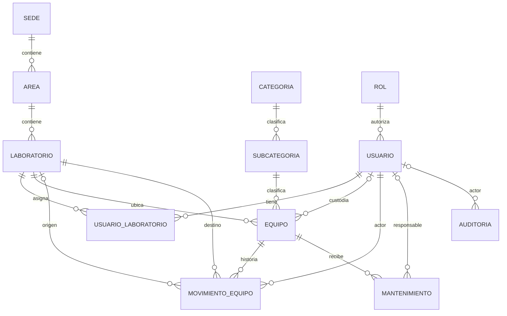

# Modelo vigente — Flyway V1–V13

**Revisión documental:** 3 de octubre de 2026, commit `e1ce75a`.
Fuente de verdad: [migraciones Flyway](../../backend/inventario/src/main/resources/db/migration/)
y [Entities JPA](../../backend/inventario/src/main/java/com/utec/inventario/entity/).
El modelo contiene **12 entidades/tablas del dominio y 16 relaciones FK**.
`flyway_schema_history` es infraestructura y no cuenta como entidad del negocio.

El [ERD lógico v2](erd-logico-v2.md), el [ERD físico v2](erd-fisico-v2.md)
y sus SVG conservan el corte V1–V9: 10 entidades y 13 relaciones.
No fueron regenerados como imágenes V13. Este Markdown incorpora las dos
entidades posteriores y las modificaciones de V10/V11, sin rediseñar esquema.
La [evidencia Docker](../despliegue/verificacion-docker-actions-2026-10-03.md)
confirma las 13 migraciones exitosas y los checksums antiguos preservados.

## 1. Vista lógica actual

En el lado de la entidad referenciada, `||` significa exactamente uno y
`o|` cero o uno. La entidad hija puede tener cero o muchas filas respecto
del padre (`o{`). Las relaciones opcionales siguen siendo FK reales.
UsuarioLaboratorio es la asociación N:M con PK compuesta.

Auditoria.entidad e idEntidad **no son FK** a cada tabla de negocio:
identifican el objeto lógico del evento. Su única FK es el actor Usuario.
No existe Entity Reporte: los reportes agregan tablas ya existentes.

## 2. Entidades y relaciones físicas

| Entity | Tabla | PK | FK salientes |
|---|---|---|---|
| SedeEntity | sede | id_sede | — |
| AreaEntity | area | id_area | id_sede → sede |
| LaboratorioEntity | laboratorio | id_laboratorio | id_area → area |
| CategoriaEntity | categoria | id_categoria | — |
| SubcategoriaEntity | subcategoria | id_subcategoria | id_categoria → categoria |
| RolEntity | rol | id_rol | — |
| UsuarioEntity | usuario | id_usuario | id_rol → rol |
| UsuarioLaboratorioEntity | usuario_laboratorio | id_usuario + id_laboratorio | id_usuario → usuario; id_laboratorio → laboratorio |
| EquipoEntity | equipo | id_equipo | id_subcategoria → subcategoria; id_laboratorio → laboratorio; id_responsable → usuario (NULL permitido) |
| MovimientoEquipoEntity | movimiento_equipo | id_movimiento | id_equipo → equipo; id_laboratorio_origen → laboratorio (NULL permitido); id_laboratorio_destino → laboratorio; id_usuario_actor → usuario |
| MantenimientoEntity | mantenimiento | id_mantenimiento | id_equipo → equipo; id_responsable → usuario (NULL permitido) |
| AuditoriaEntity | auditoria | id_auditoria | id_usuario_actor → usuario (NULL permitido) |

FK originales: V1 3 + V2 3 + V3 7 = 13. V12 agrega 2 y V13 agrega 1:
**16 FK**. Los identificadores simples siguen SERIAL/INTEGER con secuencia;
UsuarioLaboratorio mantiene una PK compuesta. Las bajas lógicas no eliminan
filas ni sus relaciones.

## 3. Cambios físicos después de V9

| Migración | Efecto |
|---|---|
| [V10](../../backend/inventario/src/main/resources/db/migration/V10__estado_operativo_laboratorio.sql) | Añade laboratorio.estado_operativo VARCHAR(20) NOT NULL DEFAULT OPERATIVO y CHECK OPERATIVO/MANTENIMIENTO. Es independiente de activo. |
| [V11](../../backend/inventario/src/main/resources/db/migration/V11__administracion_usuarios.sql) | Detecta duplicados de username/email IgnoreCase y añade UNIQUE INDEX sobre UPPER(email). Conserva índices anteriores y credenciales; cargo ya existía en V2. |
| [V12](../../backend/inventario/src/main/resources/db/migration/V12__crear_mantenimientos.sql) | Crea mantenimiento, sus dos FK, CHECK de tipo/estado/ciclo y UNIQUE parcial de un EN_PROCESO por Equipo. |
| [V13](../../backend/inventario/src/main/resources/db/migration/V13__crear_auditoria.sql) | Crea auditoria, FK opcional de actor con ON DELETE SET NULL, CHECK y tres índices. |

### Mantenimiento — columnas añadidas por V12

| Columna | Tipo físico / nulabilidad / valor inicial |
|---|---|
| id_mantenimiento | INTEGER PK, SERIAL |
| id_equipo | INTEGER NOT NULL, FK |
| tipo | VARCHAR(30) NOT NULL |
| descripcion | VARCHAR(2000) NOT NULL |
| fecha_programada | DATE NOT NULL |
| fecha_inicio | TIMESTAMPTZ NULL |
| fecha_fin | TIMESTAMPTZ NULL |
| id_responsable | INTEGER NULL, FK |
| estado | VARCHAR(30) NOT NULL DEFAULT PROGRAMADO |
| observaciones | TEXT NULL; CHECK longitud ≤4000 |
| estado_equipo_anterior | VARCHAR(30) NULL |
| fecha_creacion | TIMESTAMPTZ NOT NULL DEFAULT CURRENT_TIMESTAMP |
| fecha_actualizacion | TIMESTAMPTZ NOT NULL DEFAULT CURRENT_TIMESTAMP |

Las dos FK tienen ON UPDATE/DELETE RESTRICT. Los CHECK permiten
PREVENTIVO/CORRECTIVO/CALIBRACION/OTRO y
PROGRAMADO/EN_PROCESO/COMPLETADO/CANCELADO; también validan descripción no blanca,
fechas y coherencia del ciclo. El estado previo admite
OPERATIVO/INOPERATIVO/MANTENIMIENTO o NULL según etapa.
El índice `uq_mantenimiento_equipo_en_proceso` es UNIQUE parcial por
id_equipo **WHERE estado='EN_PROCESO'**, no una unicidad para todo mantenimiento.

### Auditoría — columnas añadidas por V13

| Columna | Tipo físico / nulabilidad / valor inicial |
|---|---|
| id_auditoria | INTEGER PK, SERIAL |
| id_usuario_actor | INTEGER NULL, FK |
| username_actor | VARCHAR(50) NOT NULL |
| accion | VARCHAR(40) NOT NULL |
| entidad | VARCHAR(40) NOT NULL |
| id_entidad | INTEGER NOT NULL, CHECK >0 |
| cambios | VARCHAR(2000) NOT NULL |
| fecha | TIMESTAMPTZ NOT NULL DEFAULT CURRENT_TIMESTAMP |

V13 limita accion/entidad mediante CHECK y exige username/cambios no blancos.
`ON DELETE SET NULL` preserva el evento si desapareciera físicamente el
actor; no autoriza DELETE de Usuario desde la API. username_actor conserva el
texto del actor; cambios es un resumen seguro, no un snapshot completo de cada
versión del objeto. La API no permite escritura libre en Auditoría.

## 4. Contraste JPA y alcance de la comprobación

LaboratorioEntity representa el nuevo estado como EnumType.STRING compatible
con VARCHAR(20). MantenimientoEntity representa tipo/estado/estado anterior
como enums string, fechaProgramada como LocalDate y fechas con hora como
OffsetDateTime. AuditoriaEntity usa EnumType.STRING para accion,
relación opcional al actor y fecha generada por PostgreSQL. Hibernate valida
el esquema; no crea nuevas tablas desde las Entities.

Las descripciones se obtuvieron leyendo DDL/Entities; esta actualización
de Markdown no abre otra conexión ni ejecuta migraciones. La comprobación
dinámica previa está en el [JSON Docker](../../frontend/version-jason/frontend/evidencias/docker-actual-2026-10-03.json):
V1–V13 exitosas, checksums iguales entre bases habitual/temporal y siete
consultas SQL con cero inconsistencias. El smoke creó fixtures solo en
`inventario_verificacion_docker_actual_5149b3ad`, que ya fue eliminada.

Los contratos, autorización y reglas están en
[endpoints](../backend-final/endpoints.md), [matriz](../matriz-permisos.md)
y [reglas](../reglas-negocio.md). Los diagramas explican estructura; no
sustituyen la evidencia de ejecución ni añaden funciones.
