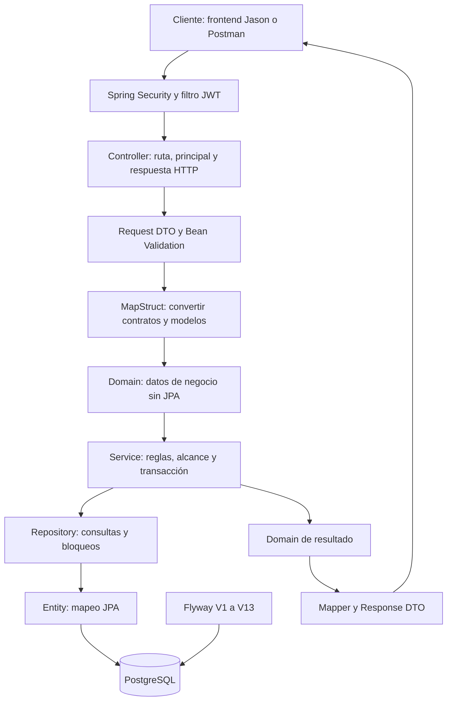

# Arquitectura del backend — estado vigente V13

Revisión documental del 3 de octubre de 2026, commit `e1ce75a`. Se conserva la arquitectura del curso; las extensiones ya implementadas se distinguen del [cierre histórico de Sprint 7](verificacion-final.md). [Evidencia Docker/Actions](../despliegue/verificacion-docker-actions-2026-10-03.md).

## 1. Estructura que conserva el proyecto

El backend de Inventario de Laboratorios expone una API REST con Spring Boot,
JWT y persistencia JPA en PostgreSQL. Conserva los paquetes y el patrón del
curso: Controller, DTO, Mapper, Domain, Service, Repository y Entity. Flyway
administra el esquema; no se genera desde las Entities.



El diagrama resume las responsabilidades. No todos los casos requieren el mismo
número de conversiones: un traslado recibe tres valores validados y el Service
devuelve un agregado de Domain con Equipo y MovimientoEquipo. No se fuerza una
Entity o un DTO de transporte dentro del dominio.

## 2. Responsabilidad de cada capa

Las rutas siguientes son relativas al paquete
`backend/inventario/src/main/java/com/utec/inventario`.

| Capa | Responsabilidad | Ejemplo |
|---|---|---|
| `config`, `security` | Autenticar y aplicar permisos por método/ruta | `SecurityConfig`, `JwtAuthFilter`, `JwtService` |
| `controller` | Recibir HTTP, extraer el principal, validar DTO y devolver status/response | `EquipoController`, `EquipoMovimientoController` |
| `dto/request` | Definir qué puede enviar el cliente y sus restricciones | `CreateEquipoRequest`, `UpdateEquipoRequest`, `TrasladarEquipoRequest` |
| `dto/response` | Exponer únicamente el contrato público | `EquipoResponse`, `MovimientoEquipoResponse` |
| `mapper` | Convertir Request → Domain, Entity → Domain y Domain → Response | `EquipoMapper`, `MovimientoEquipoMapper` |
| `domain` | Representar datos de negocio sin anotaciones JPA | `Equipo`, `MovimientoEquipo`, `TrasladoEquipo` |
| `service` | Aplicar negocio, pertenencia, normalización y límites transaccionales | `EquipoService`, `MovimientoEquipoService`, `AlcanceLaboratorioService` |
| `repository` | Expresar consultas, filtros, existencia y bloqueos | `EquipoRepository`, `MovimientoEquipoRepository` |
| `entity` | Mapear columnas, claves y relaciones del esquema | `EquipoEntity`, `MovimientoEquipoEntity` |
| `exception` | Convertir fallos en errores HTTP seguros | `GlobalExceptionHandler`, `ApiError` |

Los Mappers son interfaces MapStruct con `componentModel = "spring"` y
`unmappedTargetPolicy = ERROR`; un campo destino sin mapear genera un error de
compilación. No contienen consultas a Repository. Lombok reduce los métodos
repetitivos; las Entities usan Getter/Setter y no `@Data`, evitando generar
automáticamente igualdad o `toString` sobre relaciones JPA.

Los Controllers de inventario no deciden si un laboratorio pertenece al actor
ni si un Equipo puede trasladarse. Delegan al Service. AuthController coordina
AuthenticationManager, generación JWT y la protección del límite de 72 bytes de
BCrypt siguiendo el patrón de autenticación existente.

## 3. Autenticación, rol y pertenencia

`POST /api/auth/login` recibe usuario y contraseña; AuthenticationManager
comprueba las credenciales BCrypt y devuelve un JWT. El cliente envía después
`Authorization: Bearer <token>`. La API no autentica mediante sesión o cookies.
El filtro valida el token y recarga el usuario y rol vigentes: la autorización
no depende únicamente de un rol que quedó escrito en un token antiguo.

El rol establece **qué operaciones** puede realizar una persona. La pertenencia
establece **sobre qué laboratorios** puede realizarlas:

| Rol | Catálogos de organización/clasificación | Equipo | Traslados e historial |
|---|---|---|---|
| ADMIN | Consulta y administra | Alcance global, incluso consulta histórica bajo laboratorio inactivo | Traslada desde cualquier origen existente hacia un destino activo; consulta historial global |
| GESTOR | Consulta catálogos globales | Consulta/escribe dentro de su alcance efectivo | Requiere origen y destino dentro de su alcance para trasladar; consulta historia visible por origen o destino |
| LECTOR | Consulta catálogos globales | Solo consulta dentro de su alcance efectivo | No traslada; consulta historia visible por origen o destino |

`UsuarioLaboratorio` registra pertenencias explícitas. Para GESTOR/LECTOR,
`AlcanceLaboratorioService` exige usuario y rol vigentes, asignación activa y
laboratorio activo. Ser responsable de un Equipo no concede acceso al laboratorio.

El endpoint `GET /api/auth/me/laboratorios` devuelve laboratorios activos; para
ADMIN señala alcance global. Los Services de Equipo e historial preservan la
consulta histórica global de ADMIN y no restringen esa consulta a la lista de
laboratorios activos. Los catálogos existentes tampoco se filtran por pertenencia.

## 4. Ejemplo: crear y editar Equipo

`POST /api/equipos` valida `CreateEquipoRequest`. El Mapper convierte sus datos
en `Equipo`; el Service obtiene al actor vigente, normaliza strings y valida
estado, subcategoría, laboratorio, responsable opcional y duplicados. El nuevo
Equipo solo puede relacionarse con una subcategoría y laboratorio activos. Un
responsable nuevo debe estar activo y no obtiene acceso por esa relación.

El Service bloquea actor → subcategoría → laboratorio antes de persistir.
La base asigna ID y fechas iniciales. El resultado pasa de Entity a Domain y
de Domain a `EquipoResponse`, que usa resúmenes públicos de las relaciones.
La creación responde 201 y añade `Location`.

`PUT /api/equipos/{id}` sustituye los campos editables. El DTO no incluye ID,
código interno, laboratorio ni fechas; `@JsonAnySetter` rechaza campos
desconocidos/protegidos con 400. El Mapper también ignora esos campos al copiar
sobre la Entity existente. El Service bloquea actor → Equipo → subcategoría →
laboratorio actual, conserva la fecha de creación y establece una nueva fecha
de actualización. Mantener al mismo responsable que después quedó inactivo
está permitido; asignar uno inactivo nuevo produce conflicto.

BAJA no se establece mediante POST/PUT. `DELETE /api/equipos/{id}` realiza la
baja lógica, conserva la fila y actualiza la fecha. Un Equipo BAJA puede
consultarse según el alcance, pero no editarse, trasladarse ni reactivarse.

## 5. Ejemplo: trasladar y consultar historia

El único cambio del laboratorio de un Equipo existente desde la API se realiza
con `POST /api/equipos/{idEquipo}/traslados`:

```json
{
  "idLaboratorioDestino": 4,
  "motivo": "Traslado temporal para una práctica",
  "ubicacionInternaDestino": "Armario B"
}
```

Los IDs son ilustrativos; la demostración debe crear o seleccionar destinos
reales. El request admite esos tres campos. Motivo es obligatorio y tiene
máximo 500 caracteres; ubicación es opcional y tiene máximo 200. Actor, origen,
tipo y fecha los decide el servidor; intentar enviarlos produce 400.

Dentro de una sola transacción, `MovimientoEquipoService`:

1. Bloquea la fila del actor con FOR SHARE y verifica su vigencia y rol.
2. Bloquea Equipo con FOR UPDATE, comprueba existencia y rechaza BAJA o un mantenimiento EN_PROCESO.
3. Obtiene el origen del Equipo ya bloqueado y rechaza un destino igual.
4. Bloquea origen y destino por ID ascendente. El destino debe existir y estar activo.
5. Valida acceso efectivo de GESTOR a ambos laboratorios. ADMIN puede mover
   desde un origen inactivo hacia un destino activo.
6. Prepara el movimiento con actor autenticado, origen real, destino, tipo
   TRASLADO y motivo normalizado; conserva responsable, subcategoría y código.
7. Cambia el laboratorio de Equipo. La ubicación se sustituye por el texto
   normalizado o se limpia a NULL si se omite, es null o está en blanco.
8. Establece fechaActualizacion, envía UPDATE Equipo e INSERT Movimiento y
   devuelve 200 con `{ "equipo": ..., "movimiento": ... }`.

Si falla incluso el INSERT de Movimiento después del UPDATE, la transacción
revierte ambos. `saveAndFlush` envía SQL y permite detectar la restricción dentro
de esa operación; no confirma una transacción de forma independiente.

La Entity de Movimiento conserva origen nullable y tipo `String`, tal como
permite V3. Los traslados nuevos sí tienen origen real y escriben TRASLADO.
La fecha de Movimiento procede de PostgreSQL; los nombres incluidos en sus
resúmenes son los nombres actuales de las referencias, no copias históricas
del texto.

La historia se consulta con:

- `GET /api/equipos/{idEquipo}/movimientos`.
- `GET /api/movimientos`, con filtro opcional `idLaboratorio`.

ADMIN recibe todas las filas coincidentes, incluso con laboratorios históricos
inactivos. Para GESTOR/LECTOR, Repository filtra en SQL si origen **O** destino
está en el alcance actual. Se puede ver una historia anterior aunque el Equipo
ya esté en otro laboratorio. Por Equipo, si no hay movimientos visibles y el
laboratorio actual tampoco pertenece al alcance, se responde 403; si el Equipo
actual sí pertenece, una historia vacía devuelve 200 y `[]`.

El orden es `fechaMovimiento DESC, idMovimiento DESC`. El origen nullable se
consulta con LEFT JOIN. No se carga toda la historia para filtrarla en memoria.
Los actores se obtienen mediante una proyección pública en lote, sin seleccionar
`password_hash`; el DTO expone solo ID, username, nombre y apellido. No existen
POST libre, PUT ni DELETE de movimientos.

## 6. Transacciones y concurrencia

Los Services usan transacciones de lectura como valor predeterminado y marcan
las escrituras con `@Transactional`. Los bloqueos permanecen hasta commit o
rollback. El orden compartido evita que una operación adquiera los mismos
recursos en sentido inverso:

| Escritura | Orden relevante |
|---|---|
| Reemplazar pertenencias | Usuario FOR UPDATE → laboratorios destino por ID ascendente |
| Crear Equipo | Actor FOR SHARE → subcategoría → laboratorio |
| Editar Equipo | Actor FOR SHARE → Equipo FOR UPDATE → subcategoría → laboratorio actual |
| Baja Equipo | Actor FOR SHARE → Equipo FOR UPDATE |
| Trasladar Equipo | Actor FOR SHARE → Equipo FOR UPDATE → origen/destino por ID ascendente |
| Editar un catálogo hijo | Hijo → padre destino |
| Baja de padre | Padre; existencia de hijos mediante consulta, sin bloqueo inverso de hijos |

FOR SHARE del actor permite las comprobaciones FK y se coordina con FOR UPDATE
del reemplazo de sus asignaciones. Si la revocación confirma primero, la siguiente
escritura detecta el alcance perdido. Si la escritura obtiene primero el bloqueo
con alcance válido, la revocación espera a que termine.

Dos traslados del mismo Equipo se serializan: si buscan el mismo destino, el
segundo ve el nuevo laboratorio y recibe 409. Si buscan destinos distintos,
pueden producir dos movimientos consecutivos válidos. Baja y traslado bloquean
el mismo Equipo, por lo que ninguno usa un estado anterior al cambio confirmado.
El destino se bloquea también para coordinarse con la baja de Laboratorio.

Las restricciones UNIQUE de PostgreSQL resuelven carreras de duplicados que
superen una validación previa de existencia. El handler traduce los conflictos
conocidos a 409 sin exponer SQL. La [verificación final](verificacion-final.md)
documenta qué carreras se ejecutaron y sus resultados.

## 7. Bajas lógicas y límites del modelo

Los catálogos usan `activo = false`; Equipo utiliza `estado = BAJA`.
La baja de Categoria/Sede/Area se rechaza si existen hijos activos.
Subcategoria y Laboratorio no pueden darse de baja con Equipos no BAJA;
Laboratorio también rechaza asignaciones activas, incluso cuando el usuario
asignado está inactivo.

Un movimiento histórico no bloquea una baja lógica de laboratorio. La fila
permanece y sus FK siguen siendo válidas. La historia tampoco se borra al dar
de baja un Equipo. `RESTRICT` protege referencias frente a borrados físicos;
no sustituye las reglas de baja lógica implementadas por los Services.

El esquema mantiene `requiere_mantenimiento` y el estado MANTENIMIENTO de Equipo. Desde V12 hay MantenimientoEntity; desde V13, AuditoriaEntity. AdminUsuarioService ya administra cuentas, roles asignados y contraseñas; no hay CRUD del catálogo Rol. El [backlog](backlog.md) describe solo ampliaciones aún no implementadas.

## 8. Flyway, configuración y errores

[application.properties](../../backend/inventario/src/main/resources/application.properties)
habilita Flyway, usa `spring.jpa.hibernate.ddl-auto=validate` y desactiva
Open Session in View. Los Mappers que necesitan relaciones se ejecutan dentro
de los Services transaccionales; los Repositories cargan las relaciones públicas
necesarias con EntityGraph. El contrato HTTP nunca serializa una Entity.

Flyway está en V13. MovimientoEquipo ya estaba en V3; su vertical no requirió migración en Sprint 6. V10–V13 corresponden a las extensiones posteriores: estado operativo, email IgnoreCase, mantenimiento y auditoría. PostgreSQL genera fechas iniciales con DEFAULT; los Services actualizan fechas de cambios. El [cotejo histórico](auditoria-entity-flyway.md) conserva las 76 columnas V9; el [modelo vigente](../Erd_actual/modelo-vigente-v13.md) detalla la ampliación de esquema.

| Código | Uso en la API |
|---|---|
| 400 | JSON inválido, validaciones, campos protegidos o parámetros declarados inválidos |
| 401 | Credenciales incorrectas o autenticación ausente/inválida |
| 403 | Rol o alcance insuficiente |
| 404 | Recurso inexistente según el contrato del endpoint |
| 409 | Duplicado conocido, relación inactiva, dependencia que impide baja o transición prohibida |
| 500 | Error inesperado; respuesta pública genérica |

`ApiError` contiene timestamp, status, error, message, path y errors por campo.
Los detalles internos de SQL y las trazas no forman parte de la respuesta.
La guía de [endpoints](endpoints.md) conserva particularidades existentes, como
los IDs de Categoría sin `@Positive`; no se cambió un contrato por uniformidad.

## 9. Evidencia para la entrega

Consultar el [checklist de 26 requisitos](checklist-entrega.md), la
[verificación final](verificacion-final.md) y los
[flujos principales](flujos-principales.md). Una anotación, un diagrama o un
archivo existente demuestra estructura; el resultado de una prueba o petición
registrada demuestra comportamiento. El cierre mantiene esa distinción.


## 10. Extensiones posteriores al cierre Sprint 7

### Usuarios y catálogos administrativos

AdminUsuarioController → Request/UsuarioMapper → AdminUsuarioService →
UsuarioRepository/RolRepository → Entities JPA. ADMIN modifica el destinatario;
la identidad del actor procede de SecurityContext. El servicio serializa cambios
administrativos, protege al último ADMIN activo y guarda contraseñas BCrypt.
El PUT general solo edita nombre/apellido/email/cargo. Rol, actividad y password
usan rutas específicas. Las asignaciones mantienen su reemplazo atómico.

CatalogoAdminController consulta activos/inactivos; los cinco Controllers
de catálogo admiten PATCH de actividad. Reactivar valida padre activo y
desactivar conserva reglas por hijos, Equipos y asignaciones. estadoOperativo
de Laboratorio es independiente de activo; omitido en PUT conserva el anterior.

### Mantenimiento

MantenimientoController → DTO/MantenimientoMapper → MantenimientoService →
MantenimientoRepository/EquipoRepository → MantenimientoEntity/EquipoEntity.
El Service toma actor del principal y exige rol/alcance actual. La transacción
bloquea Equipo y Mantenimiento, valida el ciclo y coordina su estado:

`PROGRAMADO → EN_PROCESO → COMPLETADO`, con cancelación desde los dos primeros.

Iniciar guarda estado previo del Equipo y lo pone en MANTENIMIENTO.
Completar/cancelar en proceso lo restaura. Solo PROGRAMADO admite edición.
Un EN_PROCESO bloquea PUT/DELETE/traslado de Equipo; la unicidad parcial de V12
impide dos mantenimientos simultáneos en proceso para el mismo Equipo.

### Reportes y auditoría

ReporteController → FiltroReporteRequest/ReporteMapper → ReporteService →
ReporteRepository. Este Repository usa NamedParameterJdbcTemplate para
agregaciones SQL; no necesita cargar todas las Entities ni una tabla Reporte.
Es una variante existente de persistencia, no un cambio a la arquitectura.

AuditoriaService persiste las acciones de servicios en la transacción de
negocio; un rollback tampoco deja ese registro confirmado. El actor se resuelve
en servidor. AuditoriaController permite solo GET ADMIN con filtros.
AuditoriaMapper produce un DTO seguro: descripción de cambios, nunca password,
hash, token, secretos o SQL. No es un versionado completo de atributos.

## 11. Ejecución integrada

En Docker: navegador → Nginx frontend Jason → /api → Spring Security/backend →
PostgreSQL. Nginx sirve archivos React y rutas SPA; PostgreSQL mantiene el volumen
habitual. Las imágenes publicadas e1ce75a se verificaron primero con una base
temporal y después se actualizaron los contenedores habituales.

Se registraron 94 HTTP, 30 aserciones y siete consultas SQL de consistencia.
No se reejecutó JUnit/npm durante este despliegue ni en esta revisión documental.
Las 233 pruebas de Sprint 7, los 319 XML locales posteriores y las 67 pruebas
frontend se describen separadamente en la evidencia vigente.
