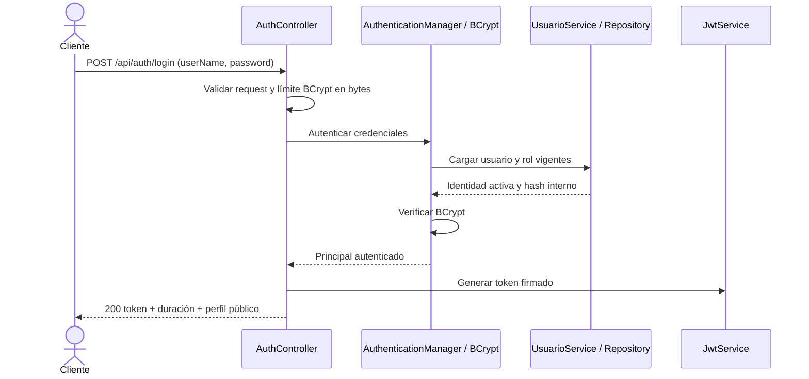
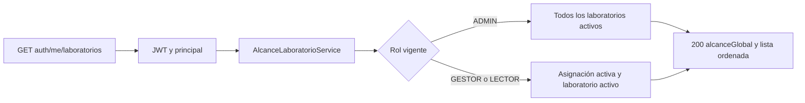
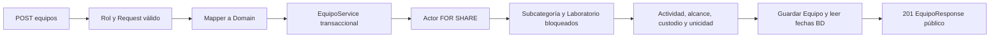
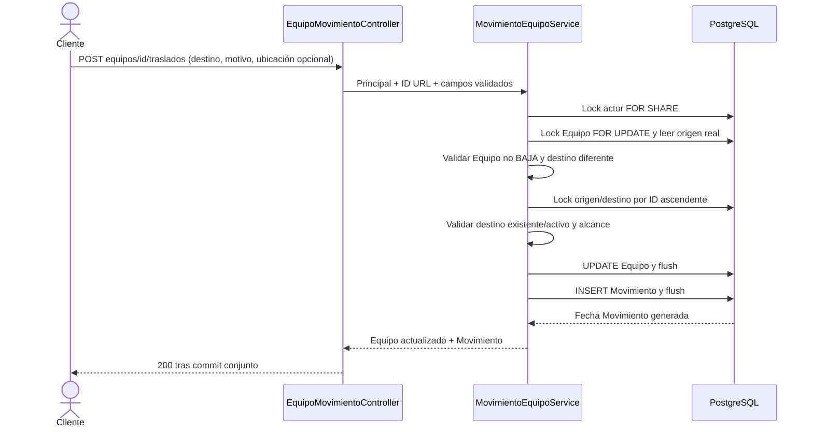

# Flujos principales del backend

Los ocho recorridos base de Sprint 7 se mantienen; las secciones 9–12 incluyen las extensiones vigentes V13/e1ce75a, revisadas documentalmente el 3 de octubre de 2026. Las reglas
detalladas están en [RN-01–45](../reglas-negocio.md), las rutas en
[endpoints](endpoints.md) y las respuestas de error en [códigos HTTP](codigos-http.md).
Los diagramas muestran responsabilidades; no agregan tablas ni operaciones.

## 1. Login

UsuarioService normaliza el nombre de acceso y exige Usuario/Rol activos.
Credenciales incorrectas producen 401; entrada inválida, 400. El hash se utiliza
internamente y no integra la respuesta. Los secretos de PostgreSQL y JWT son
variables externas. No existe registro público ni refresh token.

En la siguiente petición JwtAuthFilter valida el Bearer y vuelve a consultar
Usuario/Rol. El JWT identifica al actor; no almacena una autorización de
laboratorios congelada. Una cuenta o rol inactivo pierde acceso con su token
anterior.

## 2. Consultar alcance propio

El ID del usuario procede del contexto autenticado. ADMIN recibe
`alcanceGlobal=true`; los demás false, incluso si tienen varias asignaciones.
Una lista vacía es válida y devuelve 200. La consulta se ordena por ID de
Laboratorio. El catálogo `GET /api/laboratorios` conserva su lectura global y
el GET administrativo de asignaciones representa configuración explícita;
ninguno sustituye este contrato de alcance.

## 3. Crear Equipo

ADMIN puede crear globalmente; GESTOR necesita alcance sobre el Laboratorio
recibido; LECTOR obtiene 403. El servicio valida padres existentes/activos y,
si se proporciona, responsable existente/activo. La custodia no exige asignación
al laboratorio y no concede permisos. El servidor determina ID y fechas.

Código interno y series respetan UNIQUE de V3, sensibles a mayúsculas. Las
series blancas se normalizan a null; los demás textos opcionales también se
normalizan. POST con estado BAJA produce 409. Se bloquea actor → Subcategoría →
Laboratorio y se preserva la integridad frente a baja de padres/revocación.
No se crea un Movimiento al registrar un Equipo: el evento corresponde al traslado.

## 4. Editar Equipo

PUT `/api/equipos/{id}` usa UpdateEquipoRequest: admite únicamente los campos
editables. Código interno, Laboratorio, ID, fechas y cualquier propiedad ajena
son rechazados con 400. Es un reemplazo de campos editables, no un PATCH.

1. Se comprueba ADMIN/GESTOR y se valida la entrada.
2. EquipoService bloquea actor y Equipo, verifica alcance y rechaza BAJA o mantenimiento EN_PROCESO.
3. Valida/bloquea Subcategoría destino activa y el Laboratorio actual.
4. Comprueba responsable y duplicados excluyendo el ID propio.
5. EquipoMapper copia campos editables; el servicio actualiza fecha en UTC y guarda.
6. Devuelve 200 con datos públicos; código, Laboratorio y fechaCreacion permanecen.

Puede retirarse el responsable con null. Conservar al mismo custodio que después
quedó inactivo está permitido; asignar un custodio inactivo nuevo da 409.
Cambiar estado a BAJA por PUT da 409: la baja usa su operación propia.

## 5. Dar de baja Equipo

DELETE `/api/equipos/{id}` exige ADMIN o GESTOR dentro del alcance vigente.
Se bloquea actor → Equipo, se comprueba el estado y se modifica únicamente a
BAJA con fechaActualizacion nueva. Retorna 204 sin cuerpo. No borra físicamente
Equipo ni Movimientos; un segundo DELETE y un PUT sobre BAJA devuelven 409.

GET de Equipo continúa disponible según autorización, incluido el filtro BAJA.
Tras dar de baja el último Equipo vigente, sus padres pueden dejar de estar
bloqueados por Equipos; Laboratorio todavía puede estar bloqueado por una
asignación activa. Historia por sí sola no impide la baja lógica del Laboratorio.

## 6. Trasladar Equipo

Request acepta solamente destino positivo, motivo no blanco de máximo 500
caracteres y ubicación opcional de máximo 200. Origen, actor, tipo y fecha se
resuelven en servidor; campos adicionales dan 400. Tipo nuevo siempre TRASLADO.
La fecha del evento usa `DEFAULT CURRENT_TIMESTAMP`; representa el inicio de la
transacción PostgreSQL, no necesariamente el orden de commit.

BAJA, mismo destino y destino inactivo producen 409; destino ausente, 404.
ADMIN puede partir de un origen legacy inactivo hacia destino activo. GESTOR
necesita origen **y** destino dentro del alcance vigente; LECTOR obtiene 403.
MANTENIMIENTO e INOPERATIVO permiten trasladar solo si no existe mantenimiento EN_PROCESO; ese proceso bloquea traslado con 409.

Equipo conserva código, Subcategoría, responsable, estado y fechaCreacion.
Cambia laboratorio, ubicación y fechaActualizacion. Ubicación omitida/null/blanca
se limpia; texto informado se recorta. Las dos escrituras comparten transacción:
un fallo tardío del INSERT revierte también el UPDATE ya enviado. El bloqueo
de Equipo permite cadenas consistentes de traslados concurrentes.

## 7. Consultar historial de Equipo

GET `/api/equipos/{idEquipo}/movimientos` obtiene usuario vigente y comprueba
existencia de Equipo. ADMIN consulta toda su historia; GESTOR/LECTOR consultan
en PostgreSQL eventos con origen **o** destino dentro de su alcance actual.

| Condición para GESTOR/LECTOR | Respuesta |
|---|---|
| Equipo inexistente | 404 |
| Al menos un evento visible | 200 con solo esos eventos, aunque Equipo esté ahora fuera |
| Sin eventos visibles, Laboratorio actual permitido | `200 []` |
| Sin eventos visibles y Laboratorio actual fuera del alcance | 403 |

El permiso del detalle de Equipo no reemplaza esta regla histórica. Un Equipo
BAJA conserva su historia. Los eventos se ordenan por fecha DESC y luego ID DESC;
origen legacy null se conserva mediante LEFT JOIN. Los resúmenes de Equipo,
laboratorios y actor muestran sus datos públicos actuales, no nombres versionados.

GET `/api/movimientos` aplica la misma visibilidad global, con filtro opcional
positivo `idLaboratorio` por origen o destino. Sin alcance devuelve `[]`;
filtro explícito fuera del alcance devuelve 403. ADMIN puede filtrar un
laboratorio existente inactivo; si no existe, 404.

## 8. Asignar laboratorios a Usuario

PUT `/api/admin/usuarios/{idUsuario}/laboratorios` es exclusivo de ADMIN.
El body `idsLaboratorio` es obligatorio, admite `[]` y elementos positivos no
nulos. Los IDs se convierten a un conjunto ordenado para eliminar duplicados.

1. Se bloquea primero el Usuario destinatario; puede estar inactivo.
2. Se bloquean los laboratorios solicitados en orden ascendente de ID.
3. Se valida el conjunto completo: inexistente → 404; inactivo → 409.
4. Las relaciones retiradas pasan a inactivas; las existentes solicitadas se
   reactivan; las nuevas crean el par compuesto.
5. Se guardan los cambios juntos y se devuelve 200 con asignaciones explícitas activas.

Un error revierte el reemplazo entero. Reactivar conserva PK y fechaAsignacion
original; repetir el mismo conjunto es idempotente. La actividad del destinatario
no impide configurar sus asignaciones, pero sigue impidiendo autenticarse.

Las escrituras de Equipos/traslados bloquean su actor con FOR SHARE, por lo que
se coordinan con el reemplazo administrativo. La siguiente petición consulta
el alcance nuevo sin necesitar otro login. Cualquier asignación activa bloquea
la baja de su Laboratorio, aun cuando Usuario esté inactivo.

## 9. Administrar Usuarios

ADMIN inicia sesión y usa GET /api/admin/usuarios para seleccionar el
destinatario o POST para crearlo. Username y email se normalizan y se comprueba
su unicidad; password se guarda BCrypt. PUT modifica nombre/apellido/email/cargo.
PATCH de rol/estado y PUT de password son rutas distintas y protegen al
último ADMIN activo. Se configuran laboratorios mediante el flujo de sección 8.
Cambios de rol/actividad/asignación se leen en las siguientes solicitudes;
las respuestas nunca contienen el hash.

## 10. Actividad de catálogos y estado operativo

ADMIN consulta /api/admin/categorias, subcategorias, sedes, areas o laboratorios;
activo=false permite ver bajas. PATCH /api/{catalogo}/{id}/estado reactiva o
desactiva con validaciones de padre/dependencias. GET normal sigue mostrando
activos. PUT Laboratorio modifica estadoOperativo independientemente de activo:
OPERATIVO/MANTENIMIENTO; omitirlo conserva el anterior.

## 11. Programar y finalizar Mantenimiento

1. ADMIN/GESTOR selecciona un Equipo vigente dentro de su alcance.
2. POST /api/mantenimientos recibe Equipo, tipo, descripción y fecha programada;
   responsable/observaciones son opcionales. Responde 201 en PROGRAMADO.
3. Solo PROGRAMADO permite PUT de datos o PATCH a EN_PROCESO/CANCELADO.
4. Al iniciar, se bloquea Equipo y se guarda su estado previo; pasa a MANTENIMIENTO.
5. Durante EN_PROCESO no se permite PUT/DELETE/traslado de Equipo (409).
6. PATCH a COMPLETADO o CANCELADO termina el proceso y restaura el estado previo.
7. GET permite lectura a los tres roles por ubicación actual del Equipo.
   No existe DELETE de Mantenimiento ni reapertura de finales.

`PROGRAMADO → EN_PROCESO → COMPLETADO`, con cancelación desde PROGRAMADO
o EN_PROCESO. El índice parcial de V12 permite solo un proceso activo por Equipo.

## 12. Reportes y Auditoría

Los tres roles consultan los cinco GET /api/reportes con filtros reales.
El servidor intersecta laboratorio/organización con el alcance; el historial
de movimientos usa origen/destino y mantenimiento la ubicación actual.
Rango invertido devuelve 400 y laboratorio explícito fuera de alcance, 403.

Las escrituras de los servicios registran una descripción segura en Auditoría
dentro de la transacción. Solo ADMIN consulta GET /api/admin/auditoria y sus
filtros. No hay POST libre de auditoría, edición de Movimientos ni passwords
en las descripciones.

[Evidencia del flujo Docker vigente](../despliegue/verificacion-docker-actions-2026-10-03.md):
94 comprobaciones HTTP y 30 aserciones separadas de JUnit. La baja se comprobó
por API debido al bloqueo de automatización de la confirmación nativa del navegador.
