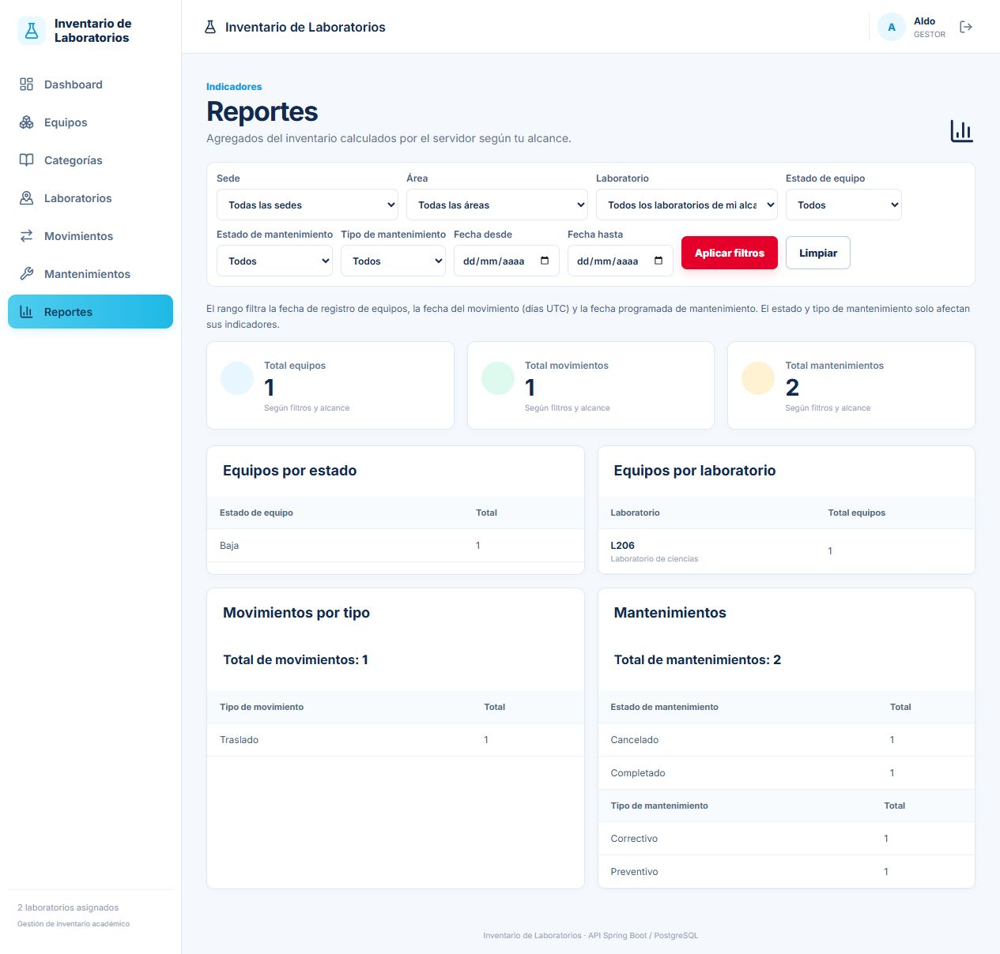
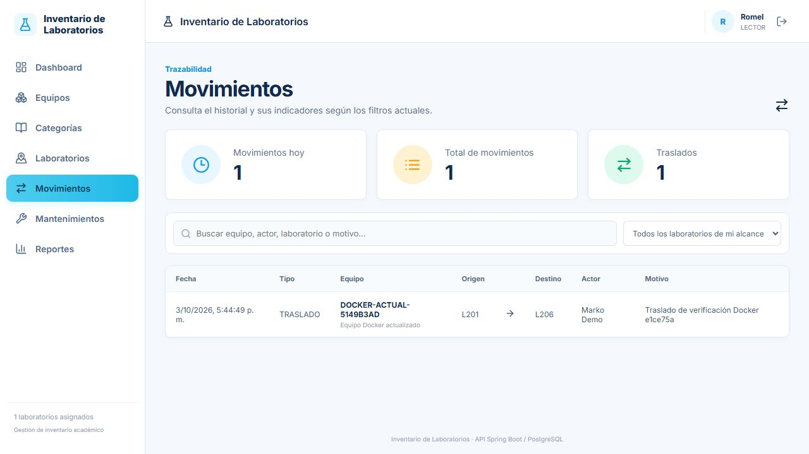

# Verificación Docker y GitHub Actions — 3 de octubre de 2026

**Estado actual: backend y frontend Jason publicados en GHCR, descargados y ejecutados en Docker local; tres contenedores saludables y PostgreSQL conservado.**

La última actualización corresponde al commit `e1ce75a1abf5058ad83ffafd85357dd0aa4c644b`. Sustituye como estado desplegado al antecedente `9956939`, cuya evidencia permanece disponible en la sección histórica. La fecha documental usa America/Lima.

Este informe registra resultados de las verificaciones ya realizadas. Su actualización Markdown no constituye una nueva ejecución de suites, un nuevo despliegue ni una modificación del código.

## 1. Evidencia y alcance

| Archivo | Qué acredita |
|---|---|
| [Docker actual: JSON](../../frontend/version-jason/frontend/evidencias/docker-actual-2026-10-03.json) | Commit `e1ce75a`, imágenes ejecutadas, salud, 94 comprobaciones HTTP, 30 aserciones funcionales, Flyway V1–V13, siete controles SQL, preservación y limpieza |
| [Actions actual: JSON](evidencias/actions-ghcr-e1ce75a-2026-10-03.json) | Consulta de la API pública: ejecución `37158784428`, commit exacto `e1ce75a` y ambos trabajos con resultado success |
| [Adaptación frontend/backend: JSON](../../frontend/version-jason/frontend/evidencias/adaptacion-backend-2026-10-03.json) | 67 pruebas frontend y build aprobados; contratos y recorridos de los módulos actuales antes de actualizar Docker |
| [Reportes GESTOR en Docker](../../frontend/version-jason/frontend/evidencias/docker-actual-reportes-2026-10-03.png) | Un equipo, un movimiento y dos mantenimientos en los fixtures temporales |
| [Historial LECTOR en Docker](../../frontend/version-jason/frontend/evidencias/docker-actual-historial-2026-10-03.png) | Consulta histórica después del traslado y la baja, dentro del alcance autorizado |
| [Reportes backend locales previos: JSON](evidencias/reportes-backend-2026-10-03.json) | Resumen extraído de 40 reportes XML: 319 pruebas, sin fallos, errores ni omitidas; no una nueva ejecución |
| [Flujo Docker anterior: JSON](evidencias/flujo-docker-2026-10-03.json) | Antecedente `9956939`: V1–V9, 33 solicitudes HTTP y 24 aserciones |
| [Actions/GHCR anterior: JSON](evidencias/actions-ghcr-2026-10-03.json) | Publicación anterior `9956939`, dos trabajos verdes y 27 pruebas frontend |

Los enlaces antiguos se conservan como antecedentes: no acreditan las imágenes ni los totales de la última actualización. Los archivos de evidencia no incluyen contraseñas, JWT ni credenciales. El respaldo PostgreSQL se guardó de forma privada fuera del repositorio.

El flujo con login y escrituras se probó **exclusivamente en una base temporal**, con las mismas imágenes publicadas que posteriormente se ejecutaron en el entorno habitual. En el habitual se verificaron salud, rutas protegidas, Flyway y preservación de datos; no se realizó login ni un recorrido con escrituras API sobre sus cuentas.

## 2. GitHub Actions y publicación actual

Workflow: [imagen.yml](../../.github/workflows/imagen.yml). Su matriz construye dos trabajos independientes en una misma ejecución.

[Ejecución 37158784428](https://github.com/markopuch/inventario-laboratorios/actions/runs/37158784428), del commit `e1ce75a`: **completed / success**, comprobada en el paso anterior a actualizar Docker local. Terminó el 3 de octubre a las **17:34:50, America/Lima**. La [evidencia de Actions actual](evidencias/actions-ghcr-e1ce75a-2026-10-03.json), obtenida mediante lectura de la API pública durante esta actualización documental, vuelve a confirmar el commit exacto y los dos trabajos exitosos.

| Trabajo | Resultado | Validación y publicación |
|---|---|---|
| [Publicar backend](https://github.com/markopuch/inventario-laboratorios/actions/runs/37158784428/job/111307629232) | success | Construcción Java/bootJar y publicación de la imagen backend |
| [Publicar frontend-jason](https://github.com/markopuch/inventario-laboratorios/actions/runs/37158784428/job/111307629348) | success | Node 22, npm ci, **67/67 pruebas frontend**, build de Vite y publicación de la imagen frontend |

El [Dockerfile backend](../../backend/inventario/Dockerfile) ejecuta `bootJar -x test`: el trabajo backend **no reejecuta JUnit**. Las pruebas frontend se ejecutan desde el checkout completo porque algunas comprueban los DTO Java. Los pasos exclusivos de Node se omiten por condición en el trabajo backend.

Estas comprobaciones de Actions corresponden a la publicación ya realizada; la consulta de la API fue de lectura y **no lanzó otro workflow**. La suite frontend local de 67 pruebas también está registrada en el JSON de adaptación. No se suman ejecuciones locales y CI como si fueran pruebas distintas.

## 3. Imágenes descargadas y ejecutadas

| Componente | Referencia fijada al commit | Digest registrado |
|---|---|---|
| Backend | `ghcr.io/markopuch/inventario-laboratorios-backend:sha-e1ce75a` | `sha256:095be10c5cda0ca715f4f06d36e431cdb9e5dd7ee8bf805e6bfab5aa890a668b` |
| Frontend Jason | `ghcr.io/markopuch/inventario-laboratorios-frontend-jason:sha-e1ce75a` | `sha256:54baf163b1f499f03c0946ba60f9539e1a4eb6d7a9600c2674f80d86716b2f44` |

En esta última comprobación **sí se descargaron y ejecutaron las imágenes publicadas en GHCR**. Sus IDs coinciden con los registrados para los contenedores habituales después de la actualización. No se presentan como equivalentes a las imágenes locales antiguas del antecedente `9956939`.

Se actualizaron los tags locales `inventario-backend:local` e `inventario-frontend-jason:local` con esas imágenes y, desde `backend/inventario`, se ejecutó:

```powershell
docker compose up -d --no-build --no-deps backend frontend
```

Se recrearon únicamente backend y frontend. No se reconstruyeron imágenes ni se recreó PostgreSQL. El [Compose existente](../../backend/inventario/docker-compose.yml) permaneció sin cambios. La etiqueta `latest` es mutable; para reproducir esta verificación se deben usar las referencias `sha-e1ce75a` registradas arriba.

## 4. Entornos y salud

El Compose integra PostgreSQL 18, Spring Boot y React/Vite servido por Nginx. El frontend solicita `/api` al mismo origen y Nginx reenvía la petición al servicio backend. PostgreSQL no publica un puerto al equipo.

| Elemento | Habitual actualizado | Verificación aislada, ya eliminada |
|---|---|---|
| Base | `inventario_laboratorios` | `inventario_verificacion_docker_actual_5149b3ad` |
| PostgreSQL | `inventario-docker-db-1`, contenedor y volumen conservados | `inventario-verificacion-actual-5149b3ad-db`, contenedor y volumen propios |
| Backend | `inventario-docker-backend-1`, `http://localhost:8080` | `inventario-verificacion-actual-5149b3ad-backend`, puerto 50687 |
| Frontend | `inventario-docker-frontend-1`, `http://localhost:3000` | `inventario-verificacion-actual-5149b3ad-frontend`, puerto 50686 |
| Red | Red existente de Compose | `inventario-verificacion-actual-5149b3ad` |
| Volumen PostgreSQL | `inventario-docker_postgres_data` | `inventario-verificacion-actual-5149b3ad-datos` |
| Escrituras de smoke | Ninguna por API | Fixtures sintéticos y recorrido completo |

El backend temporal activó el perfil `dev` para crear sus cuentas de prueba con una contraseña externa. No se restablecieron las contraseñas habituales. Las 94 comprobaciones HTTP pasaron por Nginx; no usaron Vite ni evitaron el proxy del frontend Docker.

Tras actualizar y después de limpiar el entorno temporal, **los tres contenedores habituales estaban running / healthy**.

| Lectura del entorno habitual | HTTP | Resultado |
|---|---:|---|
| `http://localhost:8080/actuator/health` | 200 | `UP` |
| `http://localhost:3000/health` | 200 | `OK` |
| `http://localhost:3000/api/auth/me` | 401 | Protegido sin JWT |
| `http://localhost:3000/api/admin/usuarios` | 401 | Ruta administrativa protegida sin JWT |
| `http://localhost:3000/api/mantenimientos` | 401 | Ruta protegida sin JWT |
| `http://localhost:3000/reportes` | 200 | Nginx sirve la ruta SPA; no equivale a obtener un reporte autenticado |

## 5. Flujo actual comprobado

**94/94 comprobaciones HTTP aprobadas, 0 fallidas; 30 aserciones funcionales aprobadas.** Incluyen respuestas exitosas y denegaciones esperadas 400/401/403/409. No representan 94 endpoints distintos ni una nueva suite JUnit.

| Flujo | Evidencia observada | Canal |
|---|---|---|
| Autenticación y alcance | Login ADMIN/GESTOR/LECTOR, perfil correcto, rechazo sin JWT o con JWT inválido y denegaciones por rol/laboratorio | API; recorridos autenticados de UI |
| Catálogos y organización | Crear, inactivar, consultar inactivos como ADMIN y reactivar; rechazos por dependencias activas | API |
| Laboratorio | `estadoOperativo` MANTENIMIENTO/OPERATIVO independiente de `activo` | API |
| Usuarios | Crear usuario temporal, editar datos públicos, cambiar rol/estado/contraseña y laboratorios; último ADMIN protegido con 409 | API |
| Crear Equipo | Registro `DOCKER-ACTUAL-5149B3AD` en L201, persistido y consultable | UI y API |
| Editar Equipo | Nombre/comentario actualizados; código interno bloqueado en el formulario | UI y API |
| Mantenimiento | PROGRAMADO → EN_PROCESO → COMPLETADO; Equipo pasa a MANTENIMIENTO y vuelve a OPERATIVO | UI y API |
| Bloqueos durante mantenimiento | Edición, baja y traslado rechazados con 409 mientras está EN_PROCESO | API |
| Cancelación | Segundo mantenimiento PROGRAMADO → CANCELADO, sin cambiar el estado operativo del Equipo; transición inválida rechazada | API |
| Traslado | L201 → L206, ubicación y motivo persistidos, actor resuelto por el servidor; origen=destino rechazado | UI y API |
| Actor del traslado | `idUsuarioActor` enviado por cliente rechazado con 400 | API |
| Baja lógica | DELETE devuelve 204; Equipo queda BAJA, no admite posteriores mutaciones y conserva el traslado | API; UI verifica estado y ausencia de botones de mutación |
| Historial y alcance | LECTOR pierde lectura del Equipo en destino no asignado, pero conserva el movimiento por su laboratorio de origen incluso después de la baja | API y UI |
| Reportes | Cinco agregados con filtros; GESTOR obtiene 1 Equipo, 1 movimiento y 2 mantenimientos; filtros fuera del alcance/rango invertido rechazados | API y UI |
| Auditoría | ADMIN consulta eventos; GESTOR recibe 403; respuestas sin secretos | API |
| Nginx/SPA | Proxy `/api` operativo y ruta directa `/usuarios` servida como SPA | HTTP |

En la última sesión de navegador comprobada se registraron **0 errores y 0 advertencias**. Esto acredita esa sesión, no una auditoría exhaustiva de todas las pantallas ni fidelidad visual completa al mockup.

### Límites de la automatización

La confirmación nativa de baja bloqueó la automatización del navegador. Se canceló el diálogo y se ejecutó/verificó la baja por HTTP; no se afirma haber completado esa confirmación en la UI durante la última prueba. El estado BAJA, la ausencia de botones y el historial posterior sí se comprobaron en la interfaz.

También se corrigieron dos errores del montaje/harness temporal: formato Base64 estándar de la clave JWT y comprobación del campo `actor` del movimiento. No fueron bugs de la aplicación y no requirieron cambios de código. En este paso no se modificaron código, migraciones, Dockerfiles ni Compose.

## 6. Flyway y preservación de PostgreSQL

Antes de reemplazar backend/frontend se creó un respaldo privado `pg_dump -Fc` de **42.156 bytes**, fuera del repositorio. Se conservaron el contenedor PostgreSQL y el volumen `inventario-docker_postgres_data`.

La base habitual pasó de V9 a **V13** aplicando las migraciones existentes V10–V13. Todas las versiones tienen `success=true`; los checksums V1–V9 permanecieron intactos. La base temporal aplicó las mismas 13 versiones, todas exitosas, con checksums coincidentes con la habitual. El arranque saludable con Hibernate en `ddl-auto=validate` confirmó compatibilidad del esquema.

| Versión | Script | Checksum | success |
|---|---|---:|---|
| V1 | `V1__crear_organizacion_y_catalogos.sql` | -1224790997 | true |
| V2 | `V2__crear_usuarios_y_seguridad.sql` | 930089448 | true |
| V3 | `V3__crear_equipos_y_movimientos.sql` | -889347868 | true |
| V4 | `V4__insertar_datos_iniciales.sql` | -30934170 | true |
| V5 | `V5__categoria_nombre_unico_sin_mayusculas.sql` | 1571040130 | true |
| V6 | `V6__agregar_username_usuario.sql` | 1971342152 | true |
| V7 | `V7__subcategoria_nombre_unico_por_categoria_sin_mayusculas.sql` | 932004306 | true |
| V8 | `V8__area_nombre_unico_por_sede_sin_mayusculas.sql` | 2043234542 | true |
| V9 | `V9__laboratorio_codigo_unico_sin_mayusculas.sql` | -204147188 | true |
| V10 | `V10__estado_operativo_laboratorio.sql` | 642141636 | true |
| V11 | `V11__administracion_usuarios.sql` | -697692969 | true |
| V12 | `V12__crear_mantenimientos.sql` | 1666773476 | true |
| V13 | `V13__crear_auditoria.sql` | -182052760 | true |

Los conteos y el contenido de las filas preexistentes de las nueve tablas se compararon antes/después. La comparación excluyó únicamente la nueva columna `estado_operativo` de laboratorio; no se publicaron hashes de contraseñas ni contenido sensible.

| Tabla habitual | Antes | Después | Contenido preexistente igual |
|---|---:|---:|---|
| usuario | 3 | 3 | Sí |
| usuario_laboratorio | 4 | 4 | Sí |
| categoria | 2 | 2 | Sí |
| subcategoria | 4 | 4 | Sí |
| sede | 1 | 1 | Sí |
| area | 2 | 2 | Sí |
| laboratorio | 2 | 2 | Sí |
| equipo | 0 | 0 | Sí |
| movimiento_equipo | 0 | 0 | Sí |

La migración dejó los dos laboratorios habituales en OPERATIVO, con cero estados inválidos; las nuevas tablas `mantenimiento` y `auditoria` quedaron vacías. La preservación no significa que el esquema permanezca en V9: V10–V13 sí se aplicaron, sin escrituras de prueba sobre las filas habituales.

## 7. Consistencia SQL y limpieza temporal

| Control SQL en la base temporal | Inconsistencias |
|---|---:|
| Equipo no BAJA bajo Subcategoría inactiva | 0 |
| Equipo no BAJA bajo Laboratorio inactivo | 0 |
| Asignación activa hacia Laboratorio inactivo | 0 |
| Movimientos huérfanos | 0 |
| Traslados con origen igual a destino | 0 |
| Mantenimientos huérfanos | 0 |
| Mantenimiento EN_PROCESO con Equipo en estado incoherente | 0 |

Los fixtures temporales finales contenían cuatro usuarios, un Equipo BAJA, un movimiento, dos mantenimientos y 36 eventos de auditoría. Esos registros no pertenecen al inventario habitual ni deben reproducirse allí para demostrar la entrega.

Después de detener las aplicaciones temporales se comprobaron **0 conexiones** a `inventario_verificacion_docker_actual_5149b3ad`. Se eliminó exclusivamente esa base y se confirmó su ausencia. Se verificó la pertenencia de los recursos antes de eliminar los tres contenedores temporales, su volumen y su red. Los puertos 50686/50687 quedaron libres y el entorno habitual siguió saludable. No se utilizó una limpieza global de Docker ni se eliminó el volumen habitual.

## 8. Antecedentes separados

| Momento/evidencia | Estado o resultado entonces | Relación con el estado actual |
|---|---|---|
| [Cierre Sprint 7](../backend-final/verificacion-final.md), 21 de septiembre | V1–V9, 233/233 pruebas JUnit y 28 solicitudes smoke | Cierre histórico; no describe las extensiones actuales ni una nueva regresión |
| [Auditoría inicial Jason](../sprints_realizados-frontend-Jason/auditoria-integracion.md), 3 de octubre | 27 pruebas frontend, 42 solicitudes HTTP y UI mediante Vite | Antecedente de integración |
| [Docker anterior](evidencias/flujo-docker-2026-10-03.json), 3 de octubre, 11:21:54–11:30:59 America/Lima | Commit `9956939`, V1–V9, 33/33 solicitudes HTTP y 24/24 aserciones, recorrido UI | Ejecutó las imágenes locales anteriores; no las imágenes GHCR del despliegue actual |
| [Actions anterior](https://github.com/markopuch/inventario-laboratorios/actions/runs/37136137900), 3 de octubre | Commit `9956939`, dos trabajos verdes, 27 pruebas frontend e imágenes publicadas | Antecedente reemplazado por Actions `37158784428` para la versión actual |
| [Reportes XML backend previos](evidencias/reportes-backend-2026-10-03.json), 3 de octubre, 13:04–13:05 America/Lima | 40 archivos de suites, 319 pruebas, 0 fallos, 0 errores y 0 omitidas | Artefactos locales previos; no certifican una nueva regresión al desplegar o editar Markdown ni corresponden al trabajo CI backend |
| [Adaptación a contratos actuales](../../frontend/version-jason/frontend/evidencias/adaptacion-backend-2026-10-03.json), 3 de octubre | V1–V13 en entorno temporal, 67/67 pruebas frontend y build; servicios y UI ampliados | Previa a actualizar Docker habitual |
| Última publicación y actualización Docker, 3 de octubre | Commit `e1ce75a`, dos trabajos verdes, 67 pruebas frontend en CI; Docker V1–V13, 94 HTTP, 30 aserciones y siete controles SQL | Estado local desplegado que documenta este informe |

En el antecedente Docker, `usuario_laboratorio` habitual tenía 0 filas y se comprobó la baja desde la UI. En la última actualización tenía **4 filas antes y después**, y la baja se verificó por API. Son observaciones de momentos y recorridos distintos; no se atribuye a las pruebas un cambio de asignaciones habituales ni se trasladan resultados de UI antiguos a la ejecución nueva.

Los resultados de esas verificaciones son independientes. No se suman para producir un total ficticio de tests. La última actualización Docker no volvió a ejecutar suites npm/JUnit; utilizó las imágenes ya publicadas y añadió comprobaciones de despliegue, HTTP, UI y SQL.

## 9. Curso y siguientes pasos

Respecto de la sesión 28, quedaron comprobados PostgreSQL, Docker con base/backend/frontend y la construcción/publicación de las dos imágenes. El Compose reúne los tres niveles en un archivo y el workflow utiliza una matriz; no se crearon archivos separados `nivel1/nivel2/nivel3` ni un workflow distinto por aplicación.

La publicación GHCR distribuye imágenes; no actualiza por sí sola los contenedores locales ni despliega servicios en nube. **PostgreSQL gestionado, backend en Render y publicación del frontend en internet siguen sin evidencia de despliegue.** Deben planificarse como trabajo posterior, con configuración y credenciales externas.

Mantenimientos y Reportes ya tienen integración real y están comprobados en la versión actual de Jason. Configuración persistida, pantalla de Auditoría y exportación de reportes no se entregaron en la adaptación frontend; la API de auditoría sí se comprobó con ADMIN. La validación Docker no cierra una auditoría completa de accesibilidad ni acredita fidelidad exhaustiva al mockup.

## 10. Capturas actuales y documentos relacionados

Reportes con el GESTOR en el entorno temporal: un Equipo, un movimiento y dos mantenimientos.



Historial consultado por el LECTOR después de trasladar y dar de baja el Equipo:



- [README del proyecto](../../README.md).
- [Sprint 8: Docker y GHCR](../sprints_realizados-backend/sprint-8.md).
- [README del frontend Jason](../../frontend/version-jason/frontend/README.md).
- [Índice de sprints Jason](../sprints_realizados-frontend-Jason/README.md).
- [Backlog vigente](../backend-final/backlog.md).
