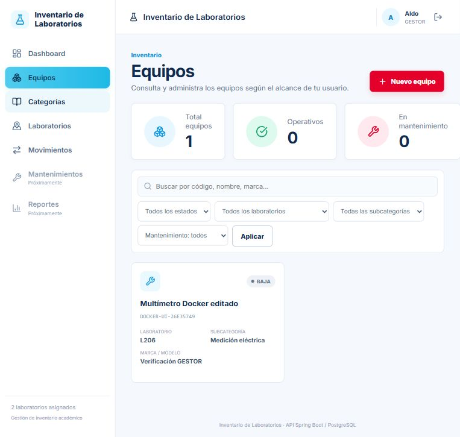
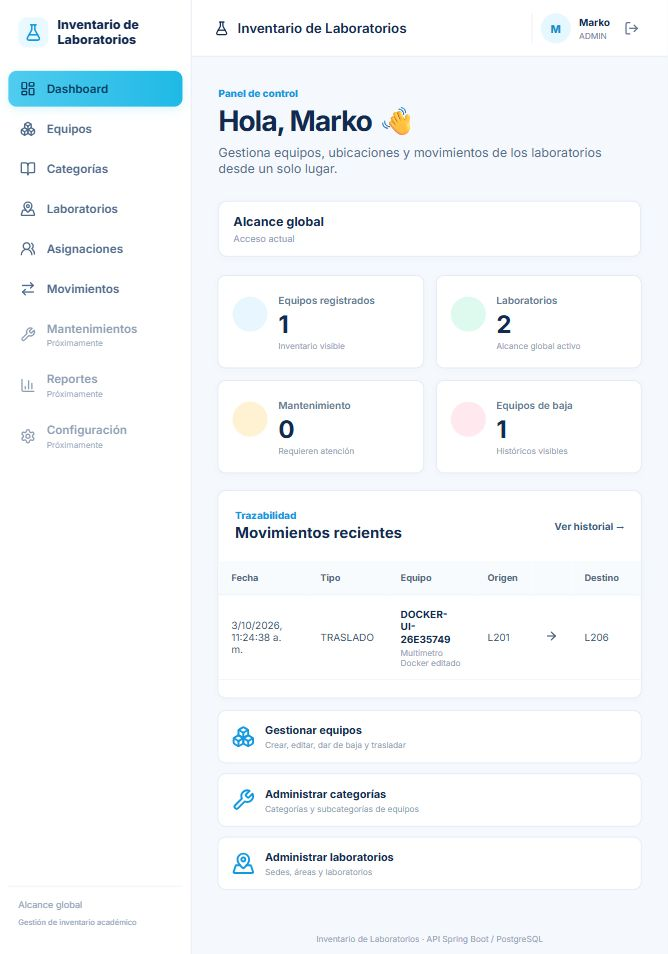

# Verificación Docker y GitHub Actions — 3 de octubre de 2026

**Estado: Docker local y publicación de backend/frontend Jason en GHCR VERIFICADOS.**

Este informe consolida las ejecuciones reales de validación Docker y comprobación
de Actions realizadas el 3 de octubre de 2026, zona America/Lima. La actualización
documental conserva sus resultados; no constituye una nueva ejecución de tests.
El commit del repositorio comprobado es `99569392035fc975171d2df6929a1aa26111b139`.

## 1. Evidencia disponible

| Archivo | Qué acredita |
|---|---|
| [Flujo Docker: JSON](evidencias/flujo-docker-2026-10-03.json) | Imágenes locales, 33 solicitudes HTTP, 24 aserciones, Flyway, SQL, conteos y limpieza |
| [Actions y GHCR: JSON](evidencias/actions-ghcr-2026-10-03.json) | Commit, ejecución, dos trabajos, pasos, 27 pruebas frontend y manifiestos remotos |
| [Equipo BAJA](evidencias/equipo-baja.png) | Registro conservado, estado BAJA y ausencia de acciones sobre ese equipo |
| [Historial conservado](evidencias/historial-conservado.png) | LECTOR consulta el traslado por su laboratorio de origen después de la baja |
| [Dashboard después de reingresar](evidencias/flujo-docker-validado.png) | Un equipo histórico, una baja y el traslado persistido |

Los archivos no contienen contraseñas, JWT ni credenciales de PostgreSQL/GHCR.
Se conservaron los resultados y capturas en el repositorio para que no dependan
de la carpeta temporal donde se generaron originalmente.

## 2. Entorno habitual y entorno de verificación

El [Compose](../../backend/inventario/docker-compose.yml) integra PostgreSQL 18,
Spring Boot y React/Vite servido por Nginx. Cada aplicación tiene su contenedor.
El frontend solicita `/api` al mismo origen; Nginx reenvía al servicio `backend`.

| Elemento | Entorno habitual | Verificación aislada |
|---|---|---|
| Proyecto Compose | `inventario-docker` | `inventario-verificacion-docker-26e35749` |
| Base | `inventario_laboratorios` del contenedor habitual | `inventario_verificacion_docker_26e35749` |
| Frontend | `http://localhost:3000` | `http://localhost:3001` |
| Backend | `http://localhost:8080` | `http://localhost:18081` |
| PostgreSQL | Volumen habitual; sin puerto al equipo | Contenedor y volumen propios, sin puerto al equipo |
| Datos | Conservados | Fixtures y escrituras de prueba; eliminados al terminar |

Las pruebas usaron exactamente los IDs de las imágenes de los contenedores
habituales, registrados en el JSON del flujo. El backend temporal activó `dev`
para crear cuentas de prueba con una contraseña externa; no se restablecieron
las cuentas habituales. Las solicitudes de comprobación pasaron por Nginx en
3001, no directamente al backend ni por Vite.

La validación se realizó de **11:21:54 a 11:30:59, America/Lima**. Al finalizar,
los tres contenedores habituales seguían saludables: frontend `/health` devolvió
`OK` y backend `/actuator/health` devolvió `UP`.

## 3. Flujo funcional comprobado

| Paso | Resultado observado |
|---|---|
| Login | ADMIN/marko, GESTOR/aldo y LECTOR/romel iniciaron sesión desde el frontend Docker |
| Preparar alcance | ADMIN asignó ambos laboratorios al GESTOR y solo el origen al LECTOR, únicamente en la base temporal |
| Crear | Se registró desde la UI `DOCKER-UI-26E35749`, subcategoría Medición eléctrica, laboratorio L201 |
| Consultar | UI y API mostraron el registro persistido; LECTOR podía leerlo en su origen autorizado |
| Editar | Se guardaron nombre, ubicación y comentario; código y laboratorio permanecieron bloqueados en el formulario e inmutables por PUT |
| Trasladar | La UI movió el equipo de L201 a L206 y guardó la nueva ubicación |
| Historial | Se comprobó un TRASLADO con origen L201, destino L206, actor marko y motivo real |
| Dar de baja | La confirmación de la UI dejó el equipo en BAJA, sin botones Editar/Trasladar/Baja sobre el registro |
| Conservar historia | Después de la baja permaneció el mismo traslado; la baja no creó otro MovimientoEquipo |
| Recarga y reingreso | La ruta SPA cargó; la sesión en memoria se perdió como está previsto y el nuevo login recuperó los datos guardados |

El GESTOR editó mediante API dentro de su alcance y vio el equipo histórico en
la UI. El LECTOR no vio acciones de escritura ni el equipo en L206, pero conservó
la consulta del movimiento por L201. La consola del navegador registró
**0 errores y 0 advertencias** durante el recorrido.

## 4. Comprobaciones HTTP y validaciones

**33/33 solicitudes HTTP adicionales al recorrido UI aprobadas; 0 fallidas.
24/24 aserciones de verificación aprobadas.** El JSON incluye cada método,
ruta y estado obtenido/esperado. No son 33 endpoints distintos ni 24 tests JUnit.

Se comprobaron respuestas exitosas y rechazos esperados:

- 401 ante JWT ausente/inválido o credencial incorrecta.
- 403 ante escritura LECTOR o acceso al laboratorio de destino no asignado.
- 400 ante laboratorio enviado por PUT o actor ajeno enviado en un traslado.
- 409 ante traslado al mismo laboratorio y edición/traslado de un equipo BAJA.
- Filtros combinados por estado, laboratorio, subcategoría y mantenimiento.
- Historial único después de rechazos, traslado válido y baja.

El origen y el actor provinieron del servidor. Un rechazo no produjo movimientos
extras. Las respuestas negativas esperadas no se cuentan como fallos de la prueba.

## 5. PostgreSQL, Flyway y preservación

Las nueve migraciones V1–V9 se aplicaron exitosamente en la base temporal; cada
versión, script y checksum consta en la evidencia JSON. Se mantuvo la validación
del esquema de Hibernate y no se agregó ninguna migración.

| Comprobación SQL en la base temporal | Resultado |
|---|---:|
| Equipo no BAJA bajo Subcategoría inactiva | 0 |
| Equipo no BAJA bajo Laboratorio inactivo | 0 |
| Asignación activa hacia Laboratorio inactivo | 0 |
| Movimientos huérfanos | 0 |
| Traslados con origen igual a destino | 0 |

Los conteos de la base habitual Docker se midieron antes y después, incluida la
limpieza. No se realizaron escrituras de prueba sobre esa base.

| Tabla | Antes | Después |
|---|---:|---:|
| usuario | 3 | 3 |
| usuario_laboratorio | 0 | 0 |
| categoria | 2 | 2 |
| subcategoria | 4 | 4 |
| sede | 1 | 1 |
| area | 2 | 2 |
| laboratorio | 2 | 2 |
| equipo | 0 | 0 |
| movimiento_equipo | 0 | 0 |

La base temporal terminó con tres usuarios, tres asignaciones, un equipo BAJA y
un movimiento, además de los catálogos iniciales. Después de detener su frontend
y backend se comprobaron **0 conexiones**, se eliminó exclusivamente esa base y
se confirmó su ausencia en PostgreSQL. También se eliminaron los tres contenedores,
el volumen y la red del proyecto temporal, verificando previamente su pertenencia.

## 6. GitHub Actions y publicación real

Workflow: [imagen.yml](../../.github/workflows/imagen.yml). Usa una matriz para
crear dos trabajos independientes dentro de la misma ejecución.

[Ejecución 37136137900](https://github.com/markopuch/inventario-laboratorios/actions/runs/37136137900)
del commit `9956939`, disparada por `push` a `main`: **completed / success**.
Terminó el 3 de octubre a las 11:16:18, America/Lima.

| Trabajo | Resultado | Qué ejecutó |
|---|---|---|
| [Publicar backend](https://github.com/markopuch/inventario-laboratorios/actions/runs/37136137900/job/111240944686) | success | Construcción Java/bootJar y publicación Docker |
| [Publicar frontend-jason](https://github.com/markopuch/inventario-laboratorios/actions/runs/37136137900/job/111240944823) | success | Node 22, npm ci, **27/27 pruebas**, build de Vite y publicación Docker |

El backend construye con `bootJar -x test`: este trabajo no reejecuta la suite
JUnit histórica. Las pruebas frontend se ejecutan desde el checkout completo
porque algunas consultan DTO Java; el Dockerfile del frontend realiza su build
desde el contexto de Jason. Los pasos exclusivos del frontend se omiten por
condición en el trabajo backend, como corresponde a la matriz.

Ambas imágenes se confirmaron con consultas remotas
`docker buildx imagetools inspect`, tanto para `latest` como para `sha-9956939`.
Las dos etiquetas de cada imagen apuntaban al mismo manifiesto, con plataforma
ejecutable `linux/amd64`.

| Imagen | Etiquetas confirmadas | Digest del manifiesto |
|---|---|---|
| `ghcr.io/markopuch/inventario-laboratorios-backend` | `latest`, `sha-9956939` | `sha256:4fd197318d82d79c185bcf4d42744b3483c743442418cf37b11daf6b90d9754a` |
| `ghcr.io/markopuch/inventario-laboratorios-frontend-jason` | `latest`, `sha-9956939` | `sha256:96bc7cb6efe81bbc77ca24430c42037b3ca21ce7880593f1ce2a3591aed4ecf9` |

Los digests remotos identifican las imágenes publicadas; los IDs del flujo Docker
identifican las imágenes locales ejecutadas. No se confunden estos registros ni
se afirma haber ejecutado las imágenes descargadas de GHCR. `latest` es una
etiqueta mutable: esta coincidencia corresponde a la fecha de comprobación.

## 7. Resultados históricos separados

| Evidencia | Resultado | Tipo |
|---|---|---|
| [Sprint 7](../backend-final/verificacion-final.md), 21 de septiembre | 233/233 pruebas y 28 solicitudes smoke | Regresión JUnit y cierre del backend |
| [Auditoría inicial Jason](../sprints_realizados-frontend-Jason/auditoria-integracion.md), 3 de octubre | 27 pruebas frontend, 42 solicitudes HTTP y UI | Integración mediante Vite; base temporal anterior eliminada |
| Esta validación Docker, 3 de octubre | 33 solicitudes HTTP y 24 aserciones, además de UI | Flujo en Nginx/backend/PostgreSQL Docker |
| Actions `9956939`, 3 de octubre | Dos trabajos verdes y 27 pruebas frontend | Construcción y publicación GHCR |

Son evidencias independientes; no se suman para producir un total ficticio de
tests. La actualización de Markdown no reejecutó suites, reconstruyó imágenes
ni cambió los datos del inventario.

## 8. Estado del curso y próximos pasos

Respecto de la sesión 28, quedan comprobados PostgreSQL, el entorno Docker que
integra base/backend/frontend y la construcción/publicación de ambas imágenes.
El Compose actual reúne los tres niveles en un archivo; no se crearon los tres
archivos `nivel1/nivel2/nivel3` de las plantillas. El workflow usa una matriz,
en lugar de dos archivos de workflows separados.

La publicación GHCR permite distribuir imágenes; no despliega automáticamente
los contenedores locales ni crea servicios de nube. **PostgreSQL gestionado y
backend en Render no tienen evidencia de ejecución y permanecen pendientes.**
La publicación del frontend en internet también debe planificarse por separado.

Los módulos frontend de Mantenimientos, Reportes y Configuración siguen como
Próximamente; las limitaciones visuales y de accesibilidad de la auditoría Jason
no se cierran mediante Docker/Actions. No se agregaron funciones de negocio,
administración completa de usuarios ni cambios de esquema en estas validaciones.

## 9. Capturas del flujo validado

Equipo dado de baja, visible para el GESTOR y sin acciones sobre el registro:

Dashboard después de recargar e iniciar sesión nuevamente; conserva la baja y
el movimiento real:

## 10. Documentos relacionados

- [README del proyecto](../../README.md).
- [Sprint 8: Docker y GHCR](../sprints_realizados-backend/sprint-8.md).
- [README del frontend Jason](../../frontend/version-jason/frontend/README.md).
- [Índice de sprints Jason](../sprints_realizados-frontend-Jason/README.md).
- [Backlog vigente](../backend-final/backlog.md).
